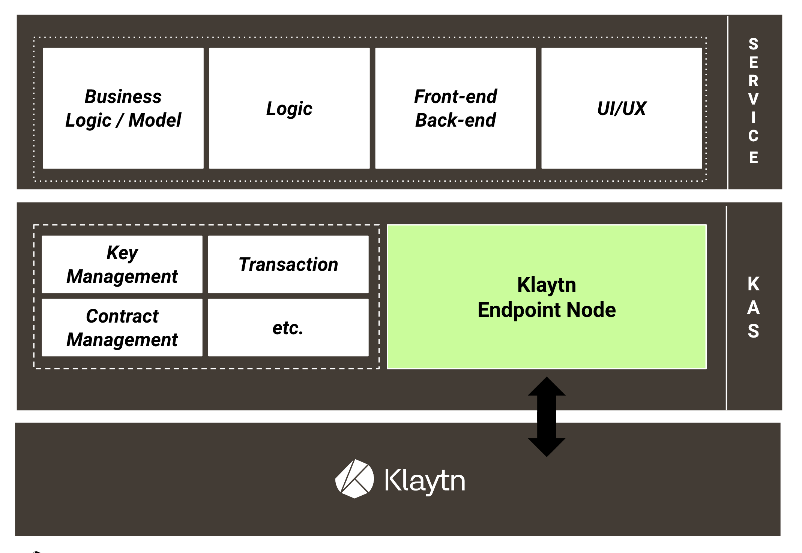

# Klaytn

* 솔리디티는 2014년 8월 처음 제안된 이후로 계속해서 업그레이드 되고 있다.
* 솔리디티는 이더리움 외에도 이더리움 클래식, 클레이튼, 텐더민트, 헤데라 해시그래프에서도 사용되며, 각 블록체인 플랫폼마다 사용하는 솔리디티 버전은 조금씩 다르다.
* 작성한 버전을 다운그레이드 하면 문법적 차이로 에러가 발생한다.

## 클레이튼에서 사용하는 0.5 vs 이더리움에서 사용하는 0.8

|차이점	|0.5 버전	|0.8 버전	|업데이트 버전|
|------|------|------|-----|
|배열의 length 권한	|length의 값을 변경하여 스토리지에 저장된 배열의 크기를 변경할 수 있다.|	   |length는 read-only	|0.6|
|push(value) 반환값|	새로운 배열의 길이 반환|	아무것도 반환하지 않음	|0.6|
|fallback 함수	|익명 함수 형태	|fallback과 receive 키워드를 사용해 fallback 함수를 지정할 수 있다.	|0.6|
|now와 block.timestamp	|글로벌 변수 now가 블록의 생성 시간을 값으로 가진다.	|now는 deprecated되고, block.timestamp로 대체되었다.	|0.7|
|UTF-8 지원|	-	|유니코드 문자열 지원한다. 문자열 앞에 unicode 키워드를 붙여 사용할 수 있다. (ex. uincode"Hello😀")	|0.7|
|상태 변환성 키워드|	-	|pure와 view 키워드로 함수에서 일어나는 스토리지 CRUD 여부를 나타낸다.	|0.7|
|누승법(exponentiation)	|왼쪽에서부터 파싱
abc 연산은 (ab)c 순서로 수행된다.	|오른쪽에서부터 파싱
abc 연산은 a(bc) 순서로 수행된다.	|0.8|
|this, super, _	|모든 함수에서 사용 가능	|public 함수와 이벤트를 제외하고 사용 불가	|0.8|
|address 타입과 address payable 타입	|address 타입 자체로 송금 가능한 주소 값	|address 타입 자체는 송금이 불가능한 주소 타입이며, address 타입을 payable(address 타입 변수) 로 변환하여야 송금 가능한 주소값 (address type)이 됨	|0.8|
|글로벌 변수 tx.origin, msg.sender 타입	|address payable 타입	|송금이 안되는 address	|0.8|

## Klaytn Wallet

* Klaytn Wallet이라는 웹 지갑
* Klaytn Wallet에서 제공해주는 Key 파일을 통해 MyEthereWallet과 같은 방식으로 사용할 수 있다.
* Kaikas Wallet
  * 메타마스크의 클레이튼 버전
* Klaytn IDE
  * https://ide.klaytn.foundation/index.html#optimize=false&runs=200&evmVersion=london&version=soljson-v0.8.7+commit.e28d00a7.js
* Web3 지갑을 지원하지 않는다.
* Run 메뉴에서 Account 옆에있는 + 버튼을 통해 계정을 연동할 수 있다.

## Truffle 연동

* 클레이튼의 스마트 컨트랙트 또한 Truffle로 컴파일하고 배포할 수 있다.
  * https://ko.docs.klaytn.com/smart-contract/ide-and-tools/truffle
* 클레이튼에서 Truffle을 사용하기 위해서는 가나슈와 같은 역할을 하는 EN 노드를 사용해야 한다.
  * https://ko.docs.klaytn.com/getting-started/quick-start/deploy-a-smart-contract#deploying-a-smart-contract-using-truffle
* 원격 EN 노드로 배포를 하기 위해서는 truffle-hdwallet-provider-klaytn 프레임워크를 사용해야한다.
  * https://www.npmjs.com/package/truffle-hdwallet-provider-klaytn

## Baobab Network에 스마트 컨트랙트 배포하기

* Baobab Network
  * 이더리움의 Ropsten Network같이 테스트넷
  * Kaikas Wallet을 통해 바오밥 네트워크에 연동이 가능하다.
* 키스토어 파일을 이용해 Klay를 받을 수 있다.
  * Private Key를 키 내보내기를 통해 얻을 수 있다.
    * 지갑키 관리 페이지에서 지갑키 내보내기를 실행한다.
* Klaytn IDE 사용 배포

1. 테스트용 코드 작성

```solidity
pragma solidity 0.5.6;

contract Count {
    uint256 public count = 0;

    function setCount(uint256 _count) public {
      count = _count;
    }
}
```

2. KLAY를 받은 계정을 IDE에 Import하여 Baobab Network에 배포를 진행한다.
3. Deploy에 성공하면 Pending에 성공했다는 로그와 함께 우측 하단에 Deployed Contract를 발견할 수 있다.
4. SetCount 함수와 Public으로 선언된 Count 변수를 확인 할 수 있다.
5. SetCount에 숫자를 넣어 트랜잭션을 실행시켜보고, Count 변수를 불러와 같은 숫자를 잘 불러오는지 확인한다.

## KIP-7 배포

* KIP-7
  * 이더리움에 존재하는 EIP와 동일한 KIP(Klaytn Improvement Proposals)가 존재
  * Fungible Token Standard에 대한 내용
  * ERC-20을 기반으로 만들어진 내용
* 기본적인 KIP-7의 인터페이스 목록

```solidity
// KIP7 Interface
event Transfer(address indexed from, address indexed to, uint256 value);
event Approval(address indexed owner, address indexed spender, uint256 value);
function totalSupply() external view returns (uint256);
function balanceOf(address account) external view returns (uint256);
function transfer(address recipient, uint256 amount) external returns (bool);
function allowance(address owner, address spender) external view returns (uint256);
function approve(address spender, uint256 amount) external returns (bool);
function transferFrom(address sender, address recipient, uint256 amount) external returns (bool);
function safeTransfer(address recipient, uint256 amount, bytes data) external;
// 이하 기본 ERC-20과 다른 함수들이 존재
function safeTransfer(address recipient, uint256 amount) external;
function safeTransferFrom(address sender, address recipient, uint256 amount, bytes data) external;
function safeTransferFrom(address sender, address recipient, uint256 amount) external;
```

* 클레이튼에서는 스마트 컨트랙트 개발을 위한 공식 라이브러리를 제공한다. 
  * https://github.com/klaytn/klaytn-contracts
* KIP-7에 대한 코드
  * https://github.com/klaytn/klaytn-contracts/blob/master/contracts/token/KIP7/KIP7.sol
* code/SimpleKlaytnToken.sol
1. KIR-7 코드를 Klaytn IDE에 입력
2. Deploy에 name과 symbol을 입력 후 Deploy
3. 토큰을 확인하기 위해 Kaikas Wallet에서 토큰 목록을 선택
4. 토큰 목록에서 새로운 토큰 추가를 위해 토큰 추가버튼을 선택
5. 복사한 토큰 컨트랙트 주소를 입력하고 확인
6. Baobab Network는 테스트넷이기 때문에 페어의 지갑으로 토큰을 이체할 수 있다.

## Klaytnscope

* 클레이튼 네트워크의 블록 탐색기
* https://scope.klaytn.com/
* 클레이튼 네트워크에서는 Klaytnscope을 사용하여 트랜잭션, 블록, 주소를 검색할 수 있다.
* 네트워크의 상태를 모니터링하고 클레이튼 네트워크에 대한 다양한 통계를 제공

### Dashboard

* 평균 블록 생성 시간, 평균 블록 내 트랜잭션 갯수, 컨센서스 노드 갯수 등을 표시
* Block Height: 마지막 블록의 높이. 제네시스부터 얼마나 많은 블록이 만들어졌는지를 보여준다.
* Network Performance: 클레이튼의 네트워크 퍼포먼스를 4개의 지표로 보여준다.
  * Consensus Nodes: 위 그림에서는 4개의 노드가 컨센서스 과정에 참여하고 있다.
  * Avg Block Time (1 Hour): 지난 한 시간 동안 평균 블록 생성 시간을 보여준다.
  * Avg Block Time (24 Hours): 지난 24시간 동안 평균 블록 생성 시간을 보여준다.
  * Avg TX Per Block (24 Hours): 지난 24시간 동안 하나의 블록에 들어가있는 트랜잭션의 평균 개수
* Transaction History (14 days): 지난 14일간 일어난 일일 트랜잭션 수 그래프. 최근 2주간의 트랜잭션 추이를 알 수 있다.
* Blocks & Transactions
  * Recent Blocks와 Recent Transactions에는 최근에 생성된 블록과 트랜잭션이 표시
* Network 상태 & Network 선택
  * 네트워크 상태 인디케이터
    * Network is healthy: Klaytnscope가 정상적으로 실행되고 있다. 
      * 네트워크 상태는 일반적인 상태이다.
    * Data Latency: Klaytnscope가 시스템 정비를 하고 있다. 
      * 데이터가 지연되고 있는 상태이다.
    * Data accuracy: Klaytnscope가 데이터를 동기화하고 있으며 기다려야 한다.
  * 네트워크 선택 드롭다운
    * 클레이튼에는 실제로 클레이튼이 거래되는 메인넷(Main Network)
    * 실제 클레이튼이 거래되지는 않지만 트랜잭션을 만들고 상태를 변경할 수 있는 바오밥 테스트넷(Baobab Network)

### Blocks

* 최근 생성된 블록의 리스트
* Block #: 블록의 고유 번호. 
  * 제네시스 블록부터 순서대로 번호가 붙는다. 
  * 누르면 해당 블록의 세부 정보를 확인할 수 있다.
* Time: 블록 생성 경과 시간
* Total TXS: 블록에 들어있는 트랜잭션의 갯수
* Block Proposer: 제안자(proposer)의 주소. 
  * 클레이튼은 컨센서스 블록체인이기 때문에 제안 노드는 컨센서스 노드에 의해 무작위적이나 결정적으로(Randomly but deterministically) 선택된다.
* Reward(Klay): 컨소시움 노드와 제안자, KIR에게 지급되는 보상 비용. 
  * 블록이 생성될 때 민팅된 9.6 KLAY와 트랜잭션 실행 시 사용된 트랜잭션 수수료의 합이 보상 비용이 된다.
* Size(Byte): 블록의 크기.

### Transactions

* 최근 실행된 트랜잭션의 리스트
* TX Hash: 트랜잭션 해시값.
  * 클릭하면 트랜잭션의 세부 정보를 확인할 수 있다.
* Block #: 트랜잭션이 속한 블록의 번호.
* Time: 트랜잭션이 실행 경과 시간
* From → To: 트랜잭션 송신자와 수신자의 주소. 
  * 주소 옆에 파일 아이콘이 있는 경우, 해당 주소는 컨트랙트 주소이다.
  * 클릭하면 해당 주소의 잔액과 거래내역을 확인할 수도 있다.
* TX Type: 트랜잭션 타입. 클레이튼의 트랜잭션 타입은 공식문서에서 확인할 수 있다.
* Amount: 트랜잭션을 통해 송금된 양
* TX Fee: 트랜잭션 실행에 대한 수수료

### Search

* 계정, 컨트랙트, 트랜잭션, 블록에 관한 정보를 검색할 수 있다.

## KAS

* Klaytn API Service
* 클레이튼 블록체인 네트워크를 API로 제공하는 서비스

 

* 네트워크 참여 및 상호작용 과정을 REST API로 실행할 수 있게 해준다.
* 블록체인 노드를 운영할 필요가 없기 때문에 노드 운영 및 관리 비용을 절감한다.
* REST API로 클레이튼 트랜잭션에 대한 조회와 전송이 가능하기 때문에 편리하다.

### KAS APIs

#### Klaytn Node API

* 클레이튼 네트워크와 상호작용하기 위해 별도의 블록체인 노드로 참여할 필요 없다.
* Klaytn Node API가 제공하는 클레이튼 엔드포인트 노드(Klaytn Endpoint Node)를 통해 클레이튼 네트워크에 접근할 수 있다.
  * 클레이튼 엔드포인트 노드가 제공하는 JSON-RPC API를 KAS를 통해 쉽게 사용할수 있게 된다.

#### Token History API

* 블록체인상에서 토큰은 화폐 또는 자산의 역할을 수행한다.
* 토큰이 가치를 가지기 위해서는 언제, 누구에게 거래되었는지 추적될 수 있어야 한다.
  * 추적을 통해 투명성과 불가역성을 바탕으로 토큰이 위변조되지 않았음을 보장할 수 있기 때문
  * 블록체인상에서 거래되는 토큰을 모니터링하고, 필요할 때마다 토큰 정보를 파악하는 것은 쉽지 않다.
  * 토큰 전송이 일어나는 모든 트랜잭션을 모니터링하고, (필요할 경우에는) 이를 저장할 데이터베이스를 구축해야 한다.
* Token History API는 모든 클레이튼 계정에서 이루어지는 토큰 전송을 데이터베이스에 기록한다.
* KLAY 및 FT(KIP-7, ERC-20), NFT(KIP-17, ERC-721) 토큰의 거래내역과 데이터를 조회하는 기능을 제공힌다.
  * 이를 통해 특정 클레이튼 계정에서 토큰을 언제, 얼마나 주고받았는지 쉽게 파악할 수 있다.
* Klayscope 

#### Wallet API

* 클레이튼 계정 키를 관리
* API를 호출하여 클레이튼 네트워크에 트랜잭션을 전송하도록 도와준다.
* Wallet API에서는 사용자 또는 bApp이 직접 관리하지 않는다.
  * KAS를 통해 계정 키를 생성 및 관리하고 트랜잭션을 생성할 경우 자동으로 서명하여 네트워크에 전송할 수 있도록 한다.
  * 블록체인 애플리케이션을 개발할 때, 계정 키를 관리하기 위한 지갑을 직접 구축하고 관리하는 것은 매우 어렵다.

#### Anchor API

* 데이터 앵커링
  * Data Anchoring
  * 프라이빗 블록체인의 데이터를 주기적으로 퍼블릭 블록체인에 기록하는 것
  * 프라이빗 블록체인의 무결성을 확보하기 위한 방식 중 하나
    * 프라이빗 블록체인은 데이터에 접근할 수 있는 사용자가 제한된다. 
    * 따라서 데이터에 위변조가 일어나도 대부분의 사용자가 이를 확인할 수 없다.
  * 주기적으로 프라이빗 블록체인에 있는 데이터의 해시값을 퍼블릭 블록체인에 기록한다.
    * 프라이빗 블록체인 사용자는 프라이빗 블록체인에서 데이터를 확인하고, 만약 두 값이 다르다면 프라이빗 블록체인에 기록된 데이터가 위변조 된 것을 알 수 있다.
* 앵커링 트랜잭션
  * anchoring transaction
  * 프라이빗 체인 데이터의 해시값을 퍼블릭 체인에 보내는 트랜잭션
* KAS의 Anchor API는 API 호출을 통해 데이터 앵커링 트랜잭션을 보낼 수 있다.
  * KAS를 통해 앵커링 트랜잭션을 보내는 오퍼레이터 계정을 생성
  * 오퍼레이터를 통해 Anchor API를 호출하여 앵커링 트랜잭션을 실행할 수 있다.