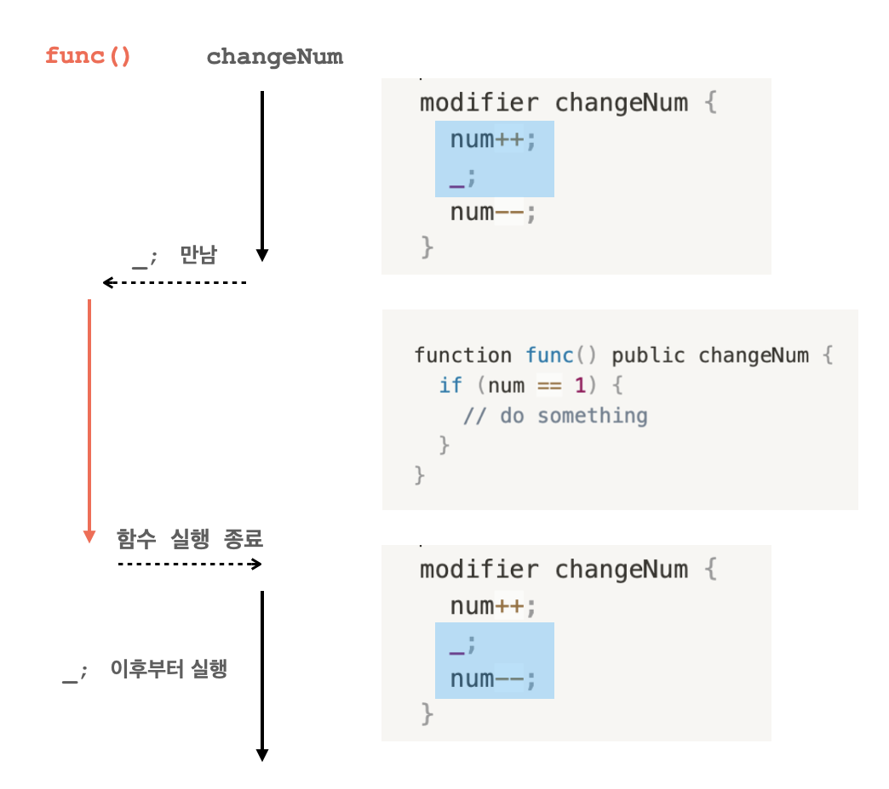

# Solidity

* EVM에서 실행되는 스마트 컨트랙트 개발을 위해 설계된 정적 타입(static-typed)의 중괄호(curly-braces) 프로그래밍 언어
* urclass/section4/ 파일 참조

## SPDX License Identifier

* 스마트 컨트랙트에 대한 신뢰를 높이고, 저작권과 같은 문제를 해소하기 위해 솔리디티 코드의 최상단에 SPDX 라이센스를 명시
* 주석으로 표기
* `// SPDX-License-Identifier: MIT`

## pragma

* 특정 컴파일러의 버전을 표기
* 다른 파일을 임포트 하더라도, pragma는 자동으로 임포트 되지 않는다.
* 같이 파일 최상단에 작성
  * `pragma solidity 0.8.7;`
* 특정 버전 이상의 pragma를 사용할 때는 ^를 붙인다.
  * `pragma solidity ^0.8.7;`

## import

* 자바스크립트에서 사용하는 방식과 유사하다.

```sol
import "파일이름";

// 임포트하는 파일을 symbolName이라는 이름으로 사용
import * as symbolName from "파일이름";  
import "파일이름" as symbolName;

// 파일의 일부분만 임포트 하는 경우
import {symbol1 as alias, symbol2} from "파일이름"; 
```

## 컨트랙트 구조

### 상태 변수(State Variables)

* 값이 컨트랙트 스토리지에 영구적으로 저장되는 변수

```sol
{데이터타입} {변수명}; // 변수명으로 선언
{데이터타입} {변수명} = {초기화할 값};  // 선언 및 초기화

pragma solidity ^0.8.7;

contract SimpleStorage {
    uint storedData; // 상태 변수 선언
    uint storedData = 20; // 상태 변수 선언 및 초기화
}
```

#### 값형 데이터 타입

##### 불(Bool)

* true나 false 값

```sol
bool isOpen = true;
bool isSold = false;
```

##### 정수(int, uint)

* int
  * 부호(+, -)가 있는 경우
* uint
  * 부호가 없는 0 이상의 값
* int, uint 뒤에 8의 배수의 숫자를 붙여 변수의 크기를 비트 단위로 지정할 수도 있다.

```sol
int8 seoulTemp = -20
uint16 myAge = 30
```

##### 고정 바이트 배열
* bytes1에서 bytes32까지의 고정된 크기의 배열을 선언

```sol
bytes3 alphabets = 'abc'

alphabets[0] // 'a'
alphabets[1] // 'b'
alphabets[2] // 'c'
```

##### 주소

* 주소(address) 객체는 0x로 시작하고 최대 40자리의 16진수로 구성되는 문자열을 값으로 가진다.
  * 크기는 20 byte
  * 주로 계정의 잔액을 반환하는 `balance()` 함수와 이더를 계정으로 전송하는 `transfer()` 함수에서 사용

```sol
address yourAddress = 0x10abb5efEcdc01234f7b2384912398798E089Ab2;
```

* 스마트 컨트랙트에서 특정 주소 값으로 송금을 하기 위해서는 **address payable** 형식을 사용해야 한다.
  * 0.8 버전부터 `address` 형식은 송금이 불가능한 주소값
* `address payable` 형식에는 이더 송금을 위한 `transfer()`와 `send()` 함수가 내장되어 있다.
* `address payable` 형식 데이터는 `address` 형식 데이터를 **payable()** 함수에 인자로 담아 만들 수 있다.

```sol
address addr1;

address payable p_addr1 = payable(addr1);
```

* `int` 또는 `bytes` 형식의 데이터를 `address payable` 로 바꾸기 위해서는 먼저 `address()`를 사용하여 주소 형태로 만들고, 다시 `payable()` 를 사용해 `address payable` 형식으로 바꿀 수 있다.

```sol
uint160 num;

address addr = address(num);

address payable p_addr = payable(addr);
```

* 컨트랙트를 address payable로 변환할 수도 있다.
  * 만약 컨트랙트가 이더를 받을 수 있는 컨트랙트인 경우, `address(컨트랙트)` 를 수행했을 때 `address payable` 형식의 주소값을 반환한다.

```sol
contract C  {  // 이더를 받을 수 있는 컨트랙트
	constructor () payable { }
} 

address payable addr = address(C);  // address(C)는 adress payable 형식의 주소값을 반환한다
```

* 컨트랙트가 이더를 받지 않는 컨트랙트인 경우, `address(컨트랙트)`를 수행했을 때 `address` 형식의 주소값을 반환한다.
  * 이 경우 결과값을 `payable()` 에 넣어 `address payable` 형식으로 만들 수 있다.

```sol
contract D { // 이더를 받지 않는 컨트랙트
	 constructor () { }
}

address addr = address(D); // address(D)는 adress 형식의 주소값을 반환한다
address payable addr_p = payable(addr); // payable()을 사용해 address payable 형식의 주소값을 만들 수 있다.
```

#### 참조형 데이터 타입

* 배열과 같이, 데이터를 저장하는 영역에 연속되어 저장되어 있는 값의 첫번째 메모리의 주소를 값으로 가지는 변수 타입
* 데이터 영역
  * 메모리
    * 프로그램이 동작하는 동안에만 값을 기억하고, 종료되면 값을 잃는 데이터 영역
  * 스토리지
    * 블록체인에 기록되어 영구적으로 값이 유지되는 데이터영역
* 참조형 변수를 선언할 때는 메모리에 저장할지 스토리지에 저장할 지 지정한다.

```sol
function f() {
	 // 5개의 int32 형태의 데이터를 메모리에 저장하는 변수 fixedSlots 선언
	int32[5] memory fixedSlots;
	fixedSlots[0] = 13;
}
```

##### 배열

* 배열은 저장하고자 하는 데이터 형식에 `[]`를 붙여 선언
* 정적 배열: `uint[4] {배열이름}` 과 같은 형식으로 사용할 배열의 크기를 지정하여 선언
* 동적 배열: `uint[] {배열이름}` 과 같은 형식으로 배열의 크기를 지정하지 않고 선언

##### 문자열

* 문자열(string)은 bytes와 동일하지만, 길이와 `push()` 는 없다.
* 문자열 리터럴로 초기화한다.

```sol
string name = 'kimcoding';
```

##### 구조체

* 서로 다른 유형의 항목을 포함하는 집합
* 사용자 정의 형식

```sol
contract exmapleC {

	struct UserInfo {
	    address account;
	    string lastName;
	    string firstName;
	}
	// 각 항목에 대한 값을 객체 형식으로 추가한다.
	function newUser (address newAddress, string newLastName, string newFirstName){
	    UserInfo memory newOne = UserInfo({account: newAddress, lastName: newLastName, firstName: newFirstName})
	}
}
```

##### 매핑(mapping)

* 매핑(mapping)은 스토리지 데이터 영역에서 `키-값` 구조로 데이터를 저장할 때 사용하는 참조형
* `mapping({키 형식}=> {값 형식}) {변수명}` 형태로 선언

```sol
mapping(address => int) public userAddress;
```

### 글로벌 변수

* 솔리디티 언어에 내장되어 있는 변수
* `block`: 블록에 대한 정보
  * `blockhash(uint blocknumber)`: 주어진 블록의 해시를 bytes32 형태로 반환
  * `coinbase`: 블록의 채굴자 주소. address 형식.
  * `gaslimit`: 블록의 가스 한도. uint 형식.
  * `number`: 블록의 번호. uint 형식.
  * `timestamp`: 블록 타임스탬프. uint 형식.
* `msg`: 컨트랙트를 시작한 트랜잭션 콜이나 메시지 콜에 대한 정보
  * `gasleft()` : 남아있는 가스의 양을 uint256 형태로 반환합니다.
  * `data`: 전체 콜데이터 본문. bytes 형식.
  * `sender`: 현재 호출을 수행하고 있는 메시지 발신자. address 형식.
  * `gas`: 남은 가스양. uint 형식.
  * `value`: 메시지와 함께 보낸 이더 금액. uint 형식.
* `tx`: 트랜잭션 데이터
  * `gasprice`: 트랜잭션 가스 비용. uint 형식.
  * `origin`: 트랜잭션 발신자. address 형식.
* `This`
  * 현재 컨트랙트를 참조
  * 현재 컨트랙트 주소로 암시적으로 변환된다.

#### 상태 변수 접근 수준

* 컨트랙트 내의 상태(state) 변수를 선언할 때는 지정할 수 있는 접근 수준
* public
  * 컴파일러가 퍼블릭 상태 변수에 getter 함수를 생성한다. 
  * 퍼블릭 상태 변수는 컨트랙트 내에서 직접 퍼블릭 상태 변수를 사용할 수 있다.
  * 외부 컨트랙트나 클라이언트 코드에서도 getter 함수를 통해 퍼블릭 상태 변수에 접근할 수 있다.
* internal
  * default
  * 컨트랙트 및 해당 컨트랙트를 상속 받은 컨트랙트만 인터널 상태 변수를 사용할 수 있다.
* private
  * 동일한 컨트랙트 멤버만 프라이빗 상태 변수에 접근할 수 있다.

#### constant

* 상태 변수를 상수로 선언할 수 있다.

```sol
pragma solidity ^0.8.7;

contract exmapleC {
    unit256 public constant maxLimit = 1000;
}
```

### 함수(Functions)

* 선언

```sol
// 선언
function 함수이름(파라미터형식1 파라미터1, 파라미터형식2 파라미터2, ...) { ... }
// 함수의 값을 반환하는 경우 
function 함수이름(파라미터,...) returns (반환 형식) { ... }
```

#### 함수 접근 수준

* `external`: 외부(external) 컨트랙트나 클라이언트 코드에서 호출할 수는 있으나, 컨트랙트 내부에서는 호출할 수 없다.
* `public` (default): 컨트랙트 내부, 외부 컨트랙트, 클라이언트 코드에서 호출할 수 있다.
* `internal`: 컨트랙트 멤버와 상속된 컨트랙트에서만 호출할 수 있다.
* `private`: 컨트랙트 멤버만 호출할 수 있다.

```sol
contract exampleC {
	function changeName(address account, string newName) internal { ... }
	function checkGas(uint256 amount) private returns (bool) { ... }
}
```

#### view, pure

* `view`: 상태를 변경하지 않는 읽기 전용 함수
* `pure`: 스토리지에서 변수를 읽거나 쓰지 않는 함수

```sol
pragma solidity ^0.8.7;
contract exmapleC {

	unit256 public constant maxLimit = 1000;
  mapping(address => bool) public frozenAccount;
    
    
	function checkGas(uint256 amount) private pure returns (bool) {
	    if (amount < maxLimit) return true;
	    return false;
	}
	
	function validateAccount(address account) internal view  returns (bool) {
	   if (frozenAccount[account]) return true;
	   return false;
	}
}
```

#### payable

* `payable`을 선언하면 함수에서 이더를 받을 수 있다.

```sol
pragma solidity ^0.8.7;
contract exmapleC {
	
	function getEther() payable returns (bool) {
	    if (msg.value === quoteFee) {
				// ... 
				
			}
		}
}
```

#### 생성자 함수(constructor)

* 생성자 함수를 선언하면, 컨트랙트가 생성될 때 생성자 함수가 실행되며 컨트랙트의 상태를 초기화할 수 있다.
* `constructor` 키워드를 사용해 생성자 함수를 선언할 수 있다.

```sol
pragma solidity ^0.8.7;
contract exmapleC {

    address public account;
    
    constructor(address _account) internal {
        account = _account
    }
}
```

#### selfdestruct

* `selfdestruct` 함수를 사용하여 컨트랙트를 소멸할 수 있다.

```sol
selfdestruct(컨트랙트 생성자의 주소);
```

### 함수 제어자(Function Modifiers)

* 함수 변경자(modifier)
* 함수 선언에 `modifier`를 추가하여 함수에 변경자를 적용할 수 있다.
* 함수를 실행하기 전, 요구 조건을 만족하는 지 확인하는 작업
* 변경자를 작성할 때는 `_;`를 사용합니다.
  * `_;`
    * 함수를 실행하는 시점
    * 변경자 코드는 `_;` 코드를 기준을 실행 시점이 달라진다.
    * `_;` 이전의 코드는 함수가 실행되기 전에 실행된다.
    * `_;` 이후의 코드는 함수 실행이 종료되고 실행된다.



### 에러(Errors)

* 에러 핸들링
* 에러를 처리할 때는 `assert`, `require`, `revert` 함수를 사용
* `revert`
  * 해당 함수를 종료하고 에러 리턴

```sol
pragma solidity ^0.8.7;

contract VendingMachine {
    address owner;

    function buy(uint amount) public payable {
        if (amount > msg.value / 2 ether)
            revert("Not enough Ether provided."); //에러를 리턴하면서 에러메시지를 지정할 수 있습니다

        // 송금 진행
    }
}
```

* `require`, `assert`
  * 설정한 조건이 참인지 확인하고, 조건이 거짓이면 에러를 리턴
  * `require`
    * 그 자체로 `if...revert` 처럼 사용되는 게이트키퍼 역할
      * 게이트키퍼(gatekeeper)
        * 조건을 만족하면 특정 동작을 실행하고, 조건을 만족하지 않으면 실행하지 못하도록 하는 역할

``` sol
pragma solidity ^0.8.4;

contract VendingMachine {
    address owner;

    function buy(uint amount) public payable {
        require(
            amount <= msg.value / 2 ether,  // 주어진 조건이 참이면 넘어가고, 거짓이면 에러 리턴
            "Not enough Ether provided."  // 에러 메시지를 지정할 수 있습니다
        );

        // 송금 진행
    }
}
```

  * `assert`
    * 사용하지 않은 가스를 호출자에게 반환하지 않고, 공급된 가스를 모두 소모하며 상태를 원래대로 되돌린다.

### 상속(inheritance)

* 상속을 통해 컨트랙트에 기능들을 추가하고, 확장할 수 있다.
* 상속을 사용하려면 부모 컨트랙트에 `is` 키워드를 지정해준다.

```sol
contract ChildContract is ParentContract {
  // ...
}

// 다중 상속도 지원한다.
contract ChildContract is ParentContract1, ParentContract2, ParentContract3 {
  // ...
}
```

### 열거형(Enum Types)

* 열거(enum)은 특정 값들로 집합을 지정하고, 집합에 있는 데이터만을 값으로 가진다.
  
```sol
// 집합 지정
enum EvalLevel { Bad, Soso, Great }
// 변수 선언
EvalLevel kimcoding = EvalLevel.Bad
// 각 집합의 데이터는 순서에 따라 0부터 1씩 올라가는 정수를 값으로 가진다.
int16 kimcodingValue = int16(kimcoding); // kimcoding 열거형 값 0을 정수형으로 변환
```

### 이벤트

* 어떤 결과가 발생했을 때 해당 컨트랙트에서 dApp 클라이언트, 또는 다른 컨트랙트에게 전달한다.
* 컨트랙트는 `event` 키워드를 사용해 이벤트를 설정하고, 경우에 따라 `emit` 키워드를 사용해 이벤트를 실행한다.
* 이벤트가 실행된 경우, 트랜잭션에 기록된다.

```sol
contract coinTransfer {
	// event 이벤트명(파라미터유형1 파라미터1, 파라미터유형2 파라미터2, ...);
	event Transfer(address from, address to, uint256 value); 

	function transfer(address to, address amount) {
		//...
		
		// emit 이벤트명(인자1, 인자2 ...)
		emit Transfer(msg.sender, to, amount);
	}
}
```