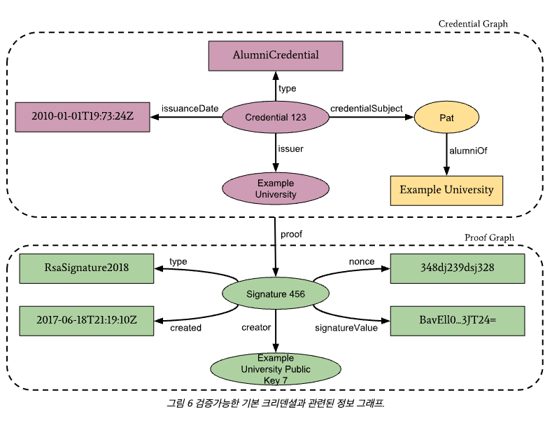
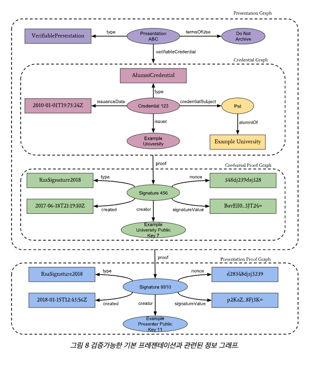

# Verifiable Credential

* 검증가능한 크리덴셜
* VC
* Credential
  * 신원 확인에 필요한 정보
  * 물리적 Credential
    * 주민등록, 운전면허, 여권 등
    * 신분증의 주체를 식별할 수 있는 정보(이름, 사진, 주민등록번호 등)
    * 신분증의 발급기관 정보(행정안전부, 경찰청, 외교부 등)
    * 발급기관이 보증하는 정보(생년월일, 면허, 국적 등)
    * 신분증의 용도(주민등록증, 운전면허증, 여권 등)
    * 신분증의 제약조건 정보(유효기관 등)
  * 디지털 세계에서는 자신의 신원과 자격을 증명하고, Credential의 유효성을 보장하기에 어렵다.
    * 위변조, 복제 위험
* W3C
  * Verifiable Credentials Data Model 
  * 자기주권신원(SSI, Self-Sovereign Identity)체계에서는 이를 검증가능한 크리덴셜(Verifiable Credential, VC)
  * 디지털 세계에서의 크리덴셜을 물리적 세계의 신분증과 동일한 정보를 제공하려는 것
  * 검증가능해야 한다.

## VC 구조

* Credential Metadata : Credential을 해석할 수 있도록 설명해주는 메타데이터(Metadata)
* Claim(s): 주체에 대한 Claim이 포함
  * 주체에 대한 정보
  * 주민등록증의 클레임
    * 이름, 주민등록번호, 주소, 발급 일자, 발급 주체
  * 연결해서 정보를 구성할 수 있다.
* Proofs : Credential을 검증가능하도록 만드는 암호학적 요소들이 포함된 증명

* 이러한 기록은 블록체인 플랫폼 기반으로 한다.
* 블록체인 상에 기록된 각 주체의 전사서명을 확인하면서, 궁극적으로 개인이 제시하고 있는 신원정보가 발급된 사실과 다르지 않다는 것을 검증할 수 있도록한다.
* Verifiable Credential(검증가능한 크리덴셜, VC) 그래프(Graph)
  * Verifiable Credential의 기본 구성 요소에 더하여, Claim이 정보 그래프로 구성되고 Verifiable Credential로 구성되는 방식에 대한 세부 정보
  * Verifiable Credential을 더 완벽하게 묘사한 것
  * 일반적으로 두 개 이상의 정보 그래프로 구성
    1. Verifiable Credential Metadata(크리덴셜 메타데이터)와 Claim을 포함하는 Verifiable Credential을 표시
    2. 일반적으로 Digital Signature(전자서명)인 Digital Proof(디지털 프루프)를 표현
  * Claim으로 정보를 확인하고, Digital Proof를 통해 확인
  * Issuer와 holder의 Digital Signature(전자서명) 포함
  * 발급내역이 블록체인에 쓰여짐, 취소된 Credential인지 아닌지 확인
  * 제대로 된 포맷인지, Schema(스키마) 검증

* 검증가능한 크레덴셜은 적합한 발급자인지 확인하기 4가지 확인
  * Issuer DID인지 진위 여부
  * holder DID인지 진위 여부
  * 블록체인의 발급내역이 유효, 무효 여부
  * Schema(스키마) 확인을 통해 형식이 맞는지를 확인

### VC 발행구조와 시나리오

### Ecosystem of Verifiable Credential(검증가능한 크리덴셜 생태계)

1. 하나 이상의 VC를 발급한다.
2. 스마트폰 앱의 디지털 지갑의 VC를 저장한다.
3. Verifier에게 증명하기 위해 VC 중 필요한 정보를 VP로 구성한다.
4. 검증자에게 VP로 검증한다.

### 자기신원인증 과정

* Issuer
  * Issuer는 holder에 대한 검증가능한 크리덴셜(VC)을 발급하여 전달한다.
  * VC의 유효성을 확인할 수 있는 ID(Identifiers)와 Schema(스키마)의 발급 내역을 블록체인에 기록한다.
* Holder
  * Issuer에게 VC를 받고, 자신이 증명서를 받았다는 내용과 스키마 정보를 가져온다.
  * 검증자가 필요로 하는 정보를 담아 VP 형태로 보낸다.
  * Issuer에게 받을 때는 VC 형태, Verifier에게 보낼 때는 VP형태이다.
* Verifier
  * Verifier는 Holder에게 받은 VP 내용을 확인힌다.
  * 블록체인에서 다음 내용을 확인한다.
    * 발급 내역
    * Schema(스키마)
  * VP 내용을 확인한다.
    * Issuer DID
    * Holder DID
  * 위의 내용들을 검증하여, VP내용의 진위 여부를 검증한다.

### 입사 지원 시나리오 예시

1. 입사지원자(holder)는 대학교(Issuer)에 본인의 졸업정보(ex, 학위번호, 학위명, 수여일자 등)을 요청한다.
2. 대학교(Issuer)는 요청정보를 확인하고 문제가 없다고 판단되면 Digital Signature(전자서명) 후 입사지원자(holder)에게 졸업증명서(Verifiable Credential)를 발행한다.
   1. 이 때, 대학교(Issuer)의 DID정보가 졸업증명서(Verifiable Credential)에 함께 저장된다.
3. 입사지원자(Holder)는 인증서를 모바일 전자지갑에 보관하며, 입사지원 시 인증서에 Digital Signature(전자서명)하여 지원기업(Verifier)에 제출한다.
4. 지원기업(Verifier)은 입사지원자(Holder)와 대학교(Issuer)의 DID를 통해 블록체인에 저장되어 있는 Digital Signature(전자서명) 검증정보를 전달받아 졸업증명서(Verifiable Credential)의 졸업 정보를 확인한다.

## Verifiable Presentation(검증가능한 프레젠테이션, VP)

* SSI(자기주권신원)의 핵심 중의 하나는 프라이버시의 보호
  * 주민등록증을 VC로 만들었을 때, 주민등록증의 모든 Claim들이 VC에 포함되어 있다.
* 자기주권신원에서는 최소한의 정보 공개(Minimum Disclosure)를 원칙으로 하여 증명이 필요한 정보들로만 구성된 새로운 형식이 필요
  * 특정 상황에서 모든 정보를 제공해야하는 경우는 거의 없다.
* VP는 여러 개의 VC를 한꺼번에 넘기는 방법
  * 인증서를 원하는 정보만 선택적으로 공개할 수 있다.

