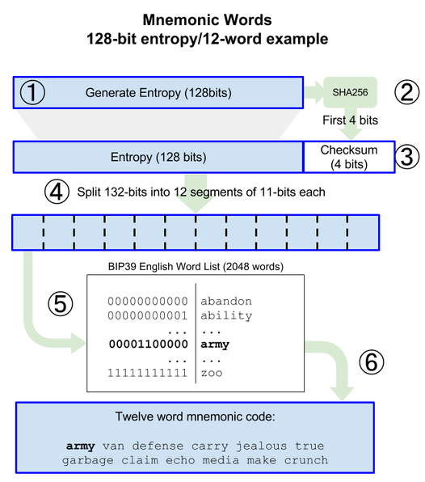
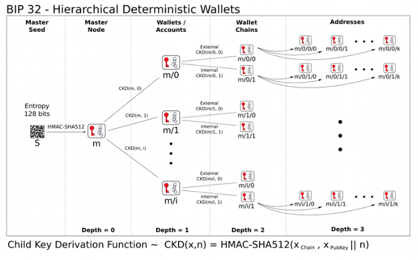

# Wallet

* 지갑의 사용과 개발
* 지갑
  * 키를 관리하는 매니지먼트 시스템
  * 내 계정에 있는 이더리움을 내 것이라고 증명할 수 있는 비밀 키를 지갑이 관리한다.

## 지갑의 종류

* 스마트컨트랙트 지갑
  * 스마트컨트랙트 기능을 통해 고유한 능력을 가진 지갑
  * 사용자를 위한 추가 보안 및 복구 기능을 사용 가능
  * 2단계 인증
    * 인증 앱 및/또는 기본 지갑 솔루션을 통해 추가 보안 기능 제공
  * ATM과 같은 인출 제한
    * 트랜잭션 금액 제한을 설정할 수 있다. 
      * 이는 사용자가 잘못 판단하여 높은 금액의 인출 가능성을 줄이고, 공격자가 한 트랜잭션에서 지갑의 모든 금액을 가져가는 것을 방지할 수 있다.
  * 화이트리스트 및 블랙리스트
    * 사용자는 자신이 지정한 주소(화이트리스트)로만 전송할 수 있고, 차단한 주소(블랙리스트)에는 전송을 안한다.
  * 사기 경보 및 긴급 잠금
    * 장치를 분실하거나 도난당한 경우 계정을 잠그거나 손상된 장치에서 계정에 대한 액세스를 비활성화 할 수 있다.
* 하드웨어 지갑
  * 거래에 서명할 때 개인 키를 인터넷에 노출하지 않기 때문에 온라인 상태에서 자산에 액세스하는 가장 안전한 방법
* 모바일 지갑
  * 데스크톱 & 웹 지갑의 모바일형 지갑
* 데스크탑(PC)지갑
  * Windows, Mac 또는 Linux같은 OS에 다운로드하여 작동할 수 있는 앱
* 웹 지갑
  * 웹사이트에서 호스팅되는 지갑으로 사용자가 계정을 생성하고, 보관할 수 있다.
    * 장점
      * 고가용성, 쉽게 접속 가능, 절대 고장 나지 않음
    * 단점
      * 보안에 관련하여 제공업체에 의존할 수 밖에 없다.
* 디지털 자산 지갑
  * 디지털 환경에서는 오프라인 환경의 직인이나 날인을 사용할 수 없다.
    * 이미지로 저장하여 붙여넣는 등 위변조가 쉽다.
  * 디지털 환경에 적합한 서명을 디지털 서명이라고 하며, 디지털 서명은 도장 대신 암호화된 비대칭키를 이용한다.
    * 공개키(Public Key)는 도장을 찍었을 때 종이에 보이는 문양
    * 개인키(Secret Key)는 도장 그 자체
    * 디지털 환경에서는 개인키와 공개키가 정확히 일치해야만 소유권을 주장할 수 있다.
  * 디지털 자산 지갑을 만들 때, 지갑의 소유권을 증명하기 위한 암호화된 비대칭키(개인키와 공개키)를 생성한다.
  * 개인키는 공개되지 않으며, 개인이 보관해야 한다.
    * 타인에게 노출되지 않도록 주의가 필요하다.
  * 공개키는 지갑의 주소로 사용된다.

### 메타마스크(Metamask)

* 이더리움을 보유하고 송금 및 관리할 수 있는 암호화폐 지갑
* 지갑 생성은 니모닉 코드(Mnemonic code)를 사용
* 전송할 때 수수료가 들어간다.

### 마이이더월렛(MEW)

* 이더리움을 보관하고 입&출금 할 수 있는 암호화폐 지갑
* 사용자들은 마이이더월렛을 이용하여 블록체인과 바로 통신할 수 있고, 이더리움 지갑을 만들어 이더리움 및 ERC20 토큰들을 보관, 전송 하거나 받을 수 있다.
* 특징
* 하드웨어 지갑 스타일 보안 기능
* 거래를 보호하기 위한 이중 인증
* 개인 키를 얻을 수 없습니다.
  * 사용자의 개인키를 점유하지 않습니다.
* 탈중앙화
  * P2P 통신을 사용한다.
  * 개인 데이터를 수집하지 않는다.
  * 오픈 소스

### Geth Wallet

* 설치

```bash
brew tap ethereum/ethereum
brew install ethereum
```

* 계정 만들기

```bash
geth account new # 새로운 계정 만들기

Your new account is locked with a password. Please give a password. Do not forget this password.
Password: 
Repeat password: 
```

* Geth에서 롭스텐 테스트넷 이더 받고, 확인하기

```bash
> geth console 2> /dev/null --ropsten # 접속

> net.listening # 네트워크 연결 확인

> eth.accounts # 계정 확인

> personal.newAccount(); # 계정 생성
Passphrase:
Repeat passphrase:

> eth.getBalance(eth.accounts[0]); # 실제로 받았는지 확인
```

### 이더스캔

* 이더리움 블록체인에서 일어나고 있는 모든 활동과 정보를 쉽게 검색할 수 있는 사이트
* 이더리움의 블록 생성 내역, 트랜잭션 조회, 지갑 정보 조회, 이더리움 기반의 토큰 검색 등 블록체인에서 일어나고 있는 모든 활동과 정보를 쉽게 검색할 수 있다.

### 클레이튼 Kaikas 월렛

* 누구나 새로운 지갑을 생성할 수 있고, PC 버전의 크롬 브라우저와 개인키 또는 시드구문만 기억하고 있다면 언제, 어디서든 자신의 지갑을 가져올 수 있다.
* Metamask 지갑은 Kaikas에서 import 하거나 반대로 Kaikas 지갑을 Metamask로 임포트 할 수 있다.
* baobab 테스트넷 전용 클레이튼
  * 메인넷에 새로운 스마트 컨트랙트를 발행하기 전 테스트해볼 수 있는 네트워크
  * 블록체인에서 스마트 컨트랙트를 생성하거나, 스마트 컨트랙트를 호출하여 연산을 실행하는 경우 체인이 요구하는 코인을 지급해야 한다.
  * 클레이튼 기반에서 스마트 컨트랙트를 생성하거나, 스마트 컨트랙트를 호출하여 연산을 실행하는 경우에는 클레이튼이 일부 사용된다.

### klip

* Klip은 Kaikas와 동일하게 클레이튼 기반의 디지털 자산 지갑
* 카카오톡 계정과 연동하여 개인키를 보관한다.
  * 개인키가 소유주를 포함한 그 누구에게도 공개되지 않는다.
  * 개인키를 분실할 우려가 없다.
  * 카카오톡 친구와 토큰이나 NFT를 주고받을 수 있다.
  * 다양한 D'app과 연동하여 사용할 수 있다.

## 니모닉(Mnemonic)

* 지갑을 복구하기 위한 일반적인 단어들의 조합
* 정보의 기억을 위한 기억술
* 숫자의 나열처럼 직관적인 관계가 없어 외우기 어려운 정보에 다른 정보를 연결하여 외우기 쉽도록 하는 데 쓰인다.
* 디지털 서명
  * 공개 키
    * public key
    * 계좌번호처럼 사용
  * 비밀 키
    * secret key
    * 타인에게 공개해서는 안 된다.
    * 비밀 키의 암호화 알고리즘 보안 성능은 2^256(2의 256승)
      * 16진수 64글자
      * 비슷하게 생긴 글자들(ex. 0,O 등)을 제외한 58개를 가지고 2^256(2의 256승)을 표현
* 비밀 키를 사람이 쓰기 편하게 만든 것이 니모닉이다.

### 니모닉 wallet

* 비밀 키 관리를 용이하게 해주고, 모든 비밀 키는 니모닉으로 관리하는 지갑이다.
* 니모닉 코드와 시드 생성 9단계
  * BIP-39에 정의되어 있으며, BIP-39는 니모닉 코드의 표준이 된다.
  * 니모닉 코드는 해시 함수를 재귀적으로 반복하는 키 스트레칭 과정을 거쳐 마스터 시드를 생성한다.
  * 마스터 시드는 HD지갑 주소 생성의 바탕이 된다.



#### HD Wallet

* Hierarchical Deterministic Wallet(계층적 결정적 지갑)
* 하나의 시드(Seed) 값만 가지고 있으면 여러 개의 주소를 쉽게 생성할 수 있는 지갑
* 여러 개의 키를 관리할 때 하나로 관리하면 되기 때문에 하나의 키로부터 다목적 관리를 할 때 좋다.
* Hierarchical는 하나에서 다른 하나를 유도하는 것, Deterministic은 트리구조가 상위의 비밀 키만 알면 하위는 다 알 수 있다는 것
  * 부모 키가 연속된 자식 키를 유도할 수 있고, 각각의 자식키는 손자 키를 유도할 수 있는 트리 구조
  * 부모 키가 자식 키의 시퀀스를 유도할 수 있고, 각각의 자식은 다시 또 손자 키의 시퀀스를 유도할 수 있다.



* HD Wallet 계정 생성 주요개념
  * 시드(seed)
    * 정수
    * HD Wallet은 시드로부터 마스터키를 생성한다. 
      * 시드는 128, 256, 512비트(bits)의 루트 시드(root seed)로 만든다.
        * 니모닉(mnemonic)으로부터 생성된다. 
        * HD Wallet의 모든 키는 루트 시드에서 결정적으로 파생되었다.
      * 생성된 시드로부터 자손 HD Wallet을 재생성할 수 있다. 
      * 이렇게 루트 시드를 파생시킨 니모닉을 전송하는 것만으로도 수천 혹은 수백만 개의 키가 포함된 HD Wallet의 내보내기, 백업, 복원, 가져오기를 쉽게 할 수 있다.
  * 경로(path)
    * 계정까지의 경로
    * 여러 개의 정수로 구성되고 개수에 제한이 없다.
    * HD Wallet 키의 경로(path)에는 규칙을 사용하여 식별한다.
    * 각 트리 레벨은 슬래시(/) 문자로 구분한다. 
    * 마스터 비밀 키로부터 파생된 비밀 키는 m, 마스터 공개키에서 파생된 공개키는 M으로 시작한다. 
      * 예를 들어, m/0은 마스터 비밀 키의 첫 번째 자식 비밀 키이고, M/0은 첫 번째 자식 공개 키가 된다. 
      * m/0/1은 마스터 비밀 키의 첫 번째 자식의 두 번째 자식 비밀 키이며, 마스터 키의 손자의 비밀 키가 된다.
