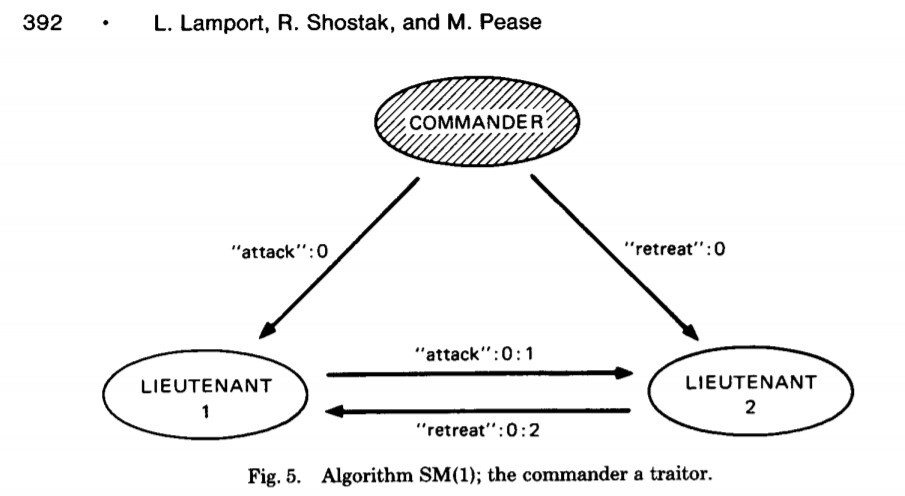
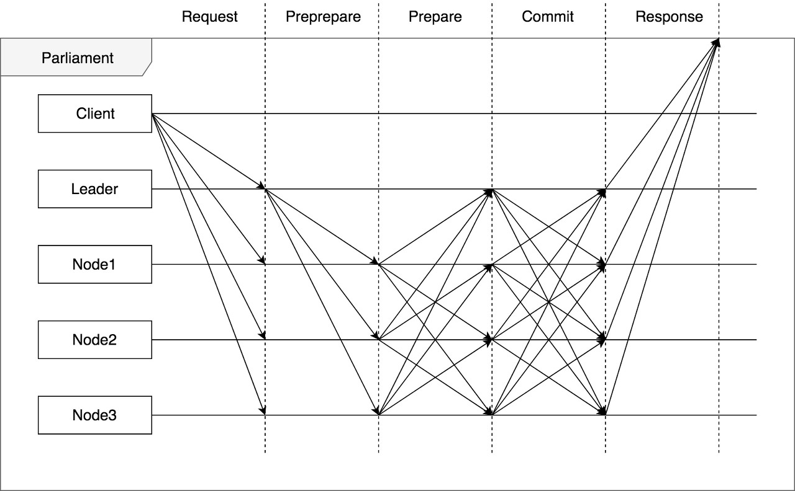
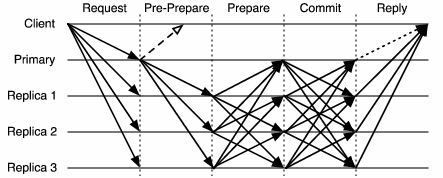
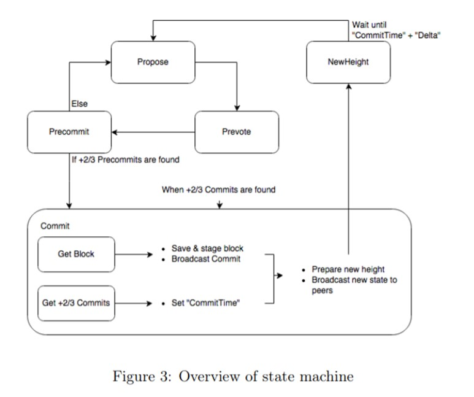

# Byzantine Fault Tolerance

* 기존 확률적 합의 알고리즘의 문제점을 개선하고자 기존 분산 시스템에서 상태 기계 복제 state machine replication를 위해 활용된 BFT 합의 알고리즘 방식

## 기존 합의 알고리즘 문제

* 작업증명 알고리즘, 지분증명 알고리즘이 적용된 블록체인이 작동하기 위해서는 내부 가상 화폐 등 보상 시스템이 필요하다.
* 가상화폐 보상이 없을 경우 작업증명, 지분증명 모두 보상이 없으면 블록을 생성할 이유도 없고, 지분 증명 매커니즘 자체를 사용할 수 없다.
* 가상화폐 외의 다른 많은 서비스를 수행하는 사설 블록체인의 경우 내부 화폐라는 보상 없이 합의 알고리즘을 사용할 수 없다.
* 기존 알고리즘은 가상 화폐가 필요하다는 문제 외에도 부분 분기가 일어날 수 있다는 문제가 있다.

## CFT Crash Fault Tolerance vs BFT Byzantine Fault Tolerance

* CFT
  * 분산시스템에서 노드가 비정상적인 충돌에 의해 문제가 생기더라도 나머지 시스템에서 서비스를 할 수 있게 하는 작동 방식
* BFT
  * 더 복잡하고 악의적인 행위자가 있을 수 있는 시스템 처리
* 블록체인 시스템에선 둘 모두 합의라는 방식을 거치게 된다.
* 비트코인의 경우 일반적인 CFT, BFT 보다 높은 수준의 신뢰 작업을 필요로 한다.
  * PoW
* 컨소시엄형 블록체인 시스템(하이퍼레저 패브릭 등)에서는 보통 조직들이 이미 신원확인등을 통해 허가를 받은 상태에서 참여하기 때문에 악의적인 행위를 하지 않을 것이라 믿고 서비스한다.
* 특정 상황의 노드에 문제가 생기는 경우에 대해서만 염두를 둔 CFT 기반의 오더링 알고리즘이 우선되고 있다.

## BFT

* Byzantine Fault Tolerance

* 1982년 lamport, shostak, pease 3인 공저
* 인공위성과 비행기에서 쓰기 위한 장애 없는 분산 컴퓨터 시스템 연구 중 발표
* 중앙 통제장치가 없는 분산 컴퓨터 시스템은 일부 노드의 장애와 해킹 공격이 있으면 시스템을 안정적으로 운영하기 어렵다는 원리
* 배신자가 있는 상황에서는 여러 장군들이 받은 명령을 진실이라고 확정하기 어렵다는 비유
* 시스템 실제로 구현한 것은 2009년 사토시 나카모토 비트코인이 처음이다.
* 비잔티움 장애 허용이라고 주로 번역된다.
* 비잔티움 장군 중 배신자를 허용한다가 아니라 배신자가 있어도 견딘다는 의미를 나타내기도 한다.

### 비잔틴 장군 문제의 상황

* n개의 비잔틴 부대가 적의 도시를 포위하고 있고 각 부대는 부대마다 배치된 장군의 명령에 따른다.
* 한 명의 장군은 나머지 n-1명 장군과 통신할 때 각각의 장군에게 전령을 보내는 것으로만 통신할 수 있다.
* 장군들은 지금 총 공격을 할 지, 조금 더 기다릴지 합의하여야 한다.
* 그러나 장군들 중 배신자가 있을 수 있고, 배신자들은 근거 없이 아무 의견이나 제시할 수 있다.
* 배신한 장군의 방해를 뚫고 공격 여부를 합의할 방법이 필요하다.
  

1. 우선 클라이언트가 모든 노드에 요청을 브로드캐스트한다.
2. 리더가 처음 순차적으로 명령을 다른 노드에 전달한다.
3. 각 노드는 브로드캐스트된 명령을 받게 되면 리더를 포함한 모든 노드에 회신을 한다.
4. 각 노드는 전달된 명령을 일정 수 이상 (2n)이 수신하면 리더를 포함한 모든 노드에 수신한 신호를 재전송한다.
5. 각 노드는 수신된 명령을 일정 수 이상 (2n) 수신하면 명령을 실행하고 블록을 등록해 client에 replay된 메시지를 반환한다.
* PoW나 PoS와는 달리 다수결로 의사결정한 뒤 블록을 만들기 때문에 블록체인의 분기가 발생하지 않는다.
* 한 번 확정된 블록은 변경되지 않기 때문에 완결성을 확보할 수 있다.
* PoW와 같이 조건을 만족시킬 때까지 계산을 반복하지 않아도 되기 때문에 매우 고속으로 동작한다.
* 부정 사용을 하고자 해도 과반수를 획득해야 한다.
* 만약 리더가 거짓말을 한다 해도 모든 참가자가 리더의 움직임을 감시해 거짓말이라고 판단한다면 다수결로 리더 교체를 신청할 수 있기 때문에 장애에 매우 강력한 내성을 지닌 알고리즘이다.
* 언제나 전원과 의사소통을 해야 하기 때문에 참가자가 증가하면 통신량이 증가하고 처리량이 저하된다.
  * PoW나 PoS는 수천개의 노드를 만들 수 있지만 PBFT는 수십개의 노드가 한계이다.

### PBFT

* Practical Byzantine Fault Tolerance
* 분산 시스템이 약속된 행동을 하지 않는 비잔틴 노드가 존재할 수 있는 비동기 시스템일 때 해당 분산 시스템에 참여한 모든 노드가 성공적으로 합의를 이룰 수 있도록 개발된 합의 알고리즘
* 기존의 BFT 합의 알고리즘이 동기식 네트워크에서만 합의가 가능했던 문제를 해결하여 비잔틴 노드가 있는 비동기 네트워크에서 합의를 이룰 수 있게 한다.

* 기존 분산 시스템에서 사용하던 합의 알고리즘은 primary, leader라 불리는 특별한 노드가 존재한다.
  * 이 노드는 클라이언트의 요청 순서를 정렬한다.
  * 요청에 대한 결과를 기입하여 최초로 다른 노드들에게 전달하는 역할을 한다.
1. 리더가 클라이언트의 요청을 수집하여 정렬하고 실행 결과와 함께 다른 노드들에게 전파한다. 
2. 리더의 메시지를 받은 노드들은 다른 노드들에서 받은 메시지를 다시 한번 나머지 노드들에게 전파한다.
3. 모든 노드는 자신이 다른 노드에서 가장 많이 받은 같은 메시지(정족수 이상의)가 무엇인지 다른 노드들에게 전파한다.
4. 위 과정이 끝나면 모든 노드들은 정족수 이상이 동의한, 합의를 이룬 같은 데이터를 가지게 된다.
* PBFT는 두번의 브로드캐스트 과정을 이용해 비잔틴 리더나 비잔틴 검증 노드가 네트워크 분기를 위해 이상한, 임의의 메시지를 보내도 네트워크의 모든 노드는 같은 메시지를 가질 수있게 한다.
* PBFT 알고리즘은 IBM Fabric 0.6v, 1.0v의 Orderer서비스, R3 Corda의 Notary와 같은 프라이빗 블록체인에서 사용하고 있다.
* 장점
  * 트랜잭션 완결성과 빠른 거래 확정
    * PBFT는 다음 블록 합의가 이루어진다면 제안된 블록의 합의 내용이 확정되어 한 번 확인 (confirmation)으로 거래가 오나결되므로 거래 확정 시간이 짧다.
  * 저에너지로 비용 감소
    * PBFT는 PoS를 기본으로 하여 에너지 사용량이 적고, 거래 비용이 적다.

## Tendermint

* Cosmos에서 사용되는 합의 알고리즘으로 PBFT 알고리즘을 공개 및 비공개 블록체인에 맞도록 개량한 합의 알고리즘
* 전통적인 합의 알고리즘이 블록체인에 적용된 의미있는 사례
* DPoS Delegated Proof-of-stake 개념과 PBFT 개념을 섞어 공개 및 비공개 블록체인에서 사용할 수 있도록 한 합의 알고리즘 
* 전체 합의 프로세스는 PBFT와 유사하다. 
* 프로세스에서 propose는 PBFT의 pre-prepare, prevote는 prepare, precommit은 PBFT의 commit으로 매칭시켜서 이해한다.
* PBFT에 DPoS개념을 추가하여 블록체인에 적합한 합의 알고리즘을 개발한다.
* 지분(stake)을 기반으로 투표를 한다. 
  * 투표하는 노드의 수보다는 지분이 중요하다. 
  * 기존의 PBFT는 하나의 노드가 하나의 투표를 하는 방식으로 투표를 받아 가장 많은 블록을 승인한다.
* 투표를 할 때 locking 매커니즘을 통해 투표에 참여한 지분을 네트워크에 동결시킨다.
* 이를 해제하는 매커니즘을 통해 이중 투표 문제를 막고 지분으로 네트워크를 유지하게 한다.
* 이중 투표 시도와 같은 블록체인을 공격하려는 악의적인 행위를 하면 지분을 빼앗는다.
  * 기존 블록체인이 네트워크 공격 노드에 아무런 처벌을 하지 않던 문제 (nothing of stake)문제를 해결한다.
* 장점
  * tendermint는 블록을 노드들에게 전파(gossip)하는 방식을 단순화하고 노드의 수를 늘리도록 한다.
  * tendermint는 블록제안자를 수시로 교체할 수 있게 하여 안정성을 높인다.
  * tendermint는 비잔티움 노드를 쉽게 발견하여 처벌할 수 있도록 한다.

## PBFT 한계

* 합의 그룹 크기가 커짐에 따라합의 속도가 느려지는 문제가 있다.
* 100개 이상의 노드를 운영하기가 쉽지 않다.
  * cosmos는 100개 노드로 운영하면 거래 확정에 약 6초가 걸린다.
* 합의 그룹의 각 노드는 모든 다른 노드들과 두번씩 메시지를 주고받아야 하기 때문에 전체 노드 N의 제곱 수준의 커뮤니케이션 교환이 필요하게 된다.
* Number of communications = N-1 + (N-1) x (N-1) + 2/3(N-1) x (N-1) = N-1 + 5/3 (N-1)(N-1)

## DBFT Delegated Byzantine Fault Tolerant

* 장점
  * 빠른 처리 속도
  * 포크가 일어나지 않고 완료성이 좋다.
* 단점
  * 특정 노드에 권력이 집중된다.
  * 노드들간에 단합할 위험이 있다. 