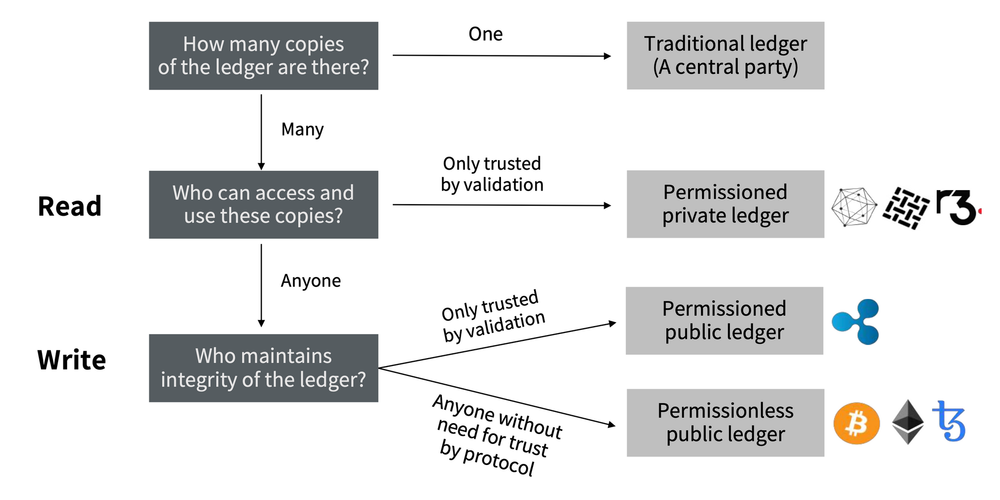

# 공개 범위에 따른 블록 체인

## Public Blockchain

* 퍼블릭 블록체인
* 개방형 블록체인
* 누구나 트랜잭션을 생성할 수 있다.
* 일반적으로 블록체인이라고 하면 이 퍼블릭 블록체인을 지칭한다. 
* 트랜잭션 내역이 모두에게 공개되어 네트워크에 참여한 모든 노드가 이를 상호검증하고 거래를 승인하기 때문에 신뢰도가 높다.
* 모든 참여자의 거래 기록을 남기고 이를 공유하느라 처리 속도가 느리다.

## Private Blockchain

* 폐쇄형 블록체인
* 서비스 제공자의 승인을 받아야만 참여할 수 있다.
* 주로 기업에서 활용하여 엔터프라이즈 블록체인이라고도 한다.
* Hyperledger
  * 하이퍼레저
  * 리눅스 재단이 끌고 있는 오픈 소스 블록체인 프로젝트
  * 프라이빗 블록체인으로 분류된다.
  * 스마트 계약을 구현할 수 있다.
  * 기업 비즈니스를 구현하기 적합하다.
  * 중앙화된 플랫폼

## Consortium Blockchain

* 동일한 목적이나 가치를 가지고 있는 다수의 기업과 단체들이 하나의 컨소시엄을 구성하고 그 안에서 작동하도록 만든 블록체인
* 프라이빗 블록체인의 한 형태
* 별도로 구별하여 하이브리드 블록체인으로 분류하기도 한다.
  * Hybrid blockchain
  * 퍼블릭 블록체인과 프라이빗 블록체인을 서로 연결하거나 두 특징을 섞은 혼합형 블록체인 형태
  * 퍼블릭 블록체인과 프라이빗 블록체인이 가지고 있는 단점을 보완하고 장점을 최대한으로 끌어올릴 수 있도록 한다.
* 퍼블릭 블록체인과 프라이빗 블록체인의 중간 형태
* 중앙 관리자에 의해 승인받은 참여자만이 블록 생성에 참여할 수 있는 프라이빗 블록체인과 유사하다.
* 같은 목적을 가지고 있는 여러 기관이 하나의 컨소시엄을 구성하여 공정성과 확장성을 보완한다. 
* 다수 참여자의 협의가 필요한 분야에서는 컨소시엄 블록체인이 효과적이다.
* 기관 간에 직접 거래함으로써 제 3자에 대한 거래 수수료를 줄이고 거래 시간을 단축할 수 있다. 
* Hyperledger fabric
  * 하이퍼레저 패브릭
  * 리눅스 재단이 주도하고 IBM이 만들었다. 