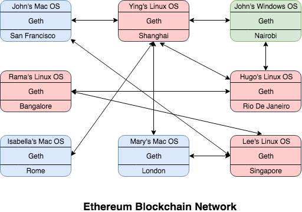
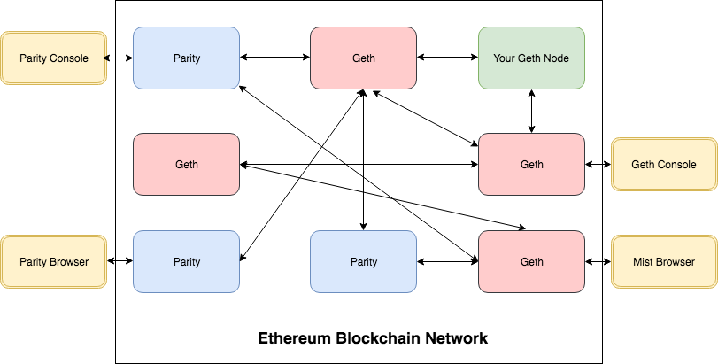

# Ethereum Client

* 이더리움 클라이언트
* 이더리움 블록체인 네트워크를 구성하는 개별 클라이언트 노드
* 중앙 집중형 서버 프로그램이 따로 존재하지 않는다.
* 오로지 클라이언트 프로그램만 존재한다.
* 멀티 플랫폼 환경을 지원하기 위해 다양한 프로그래밍 언어로 개발되고 있다.

## Geth

* 이더리움 재단이 제공하는 공식 클라이언트 소프트웨어
* Go 언어로 개발되었다.
* 처음 시작하면 네트워크 내 다른 이더리움 클라이언트 (node)에 연결하는 작업을 먼저 시작한다. 
* 블록체인의 전체 사본을 내려받게 된다.
* 블록체인 복사본을 최신 상태로 유지하기 위해 끊임없이 다른 노드와 통신한다.
* Geth를 이용해 블록을 채굴한다.
* 블록체인에 트랜잭션을 추가하고 블록의 트랜잭션을 검증하며 트랜잭션을 실행할 수 있다.
* RPC를 통해 상호작용할 수 있는 API를 노출하여 서버 역할을 하기도 한다.

## Parity

* 이더리움 프로토콜의 또 다른 구현체
* Rust로 개발되었다.
* Parity Inc. 기업에서 운영한다.
* 누구나 이더리움 황서를 참고하여 자신만의 클라이언트를 구현할 수 있다.

