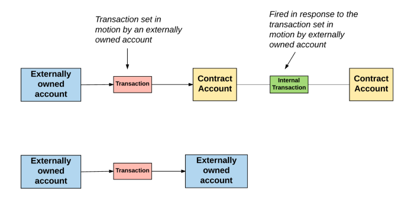
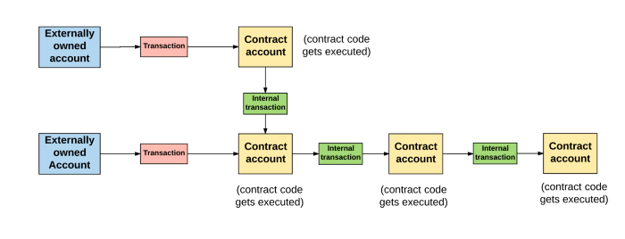

# EVM

## VM

* virtual machine
* 개발자가 짠 코드와 개발자의 컴퓨터 사이에서 추상화 수준을 생성한다.
* 환경에 따라 다르게 작동하면 안 되기 때문에 하드웨어 위에 가짜 컴퓨터를 만든다.
* 중간에 있는 가짜 컴퓨터 때문에 어떤 하드웨어에서든 동일하게 동작한다.
* 실제로는 존재하지 않기 때문에 가상 머신이라고 한다.
* 소프트웨어의 이식성을 향상시킨다.
* 애플리케이션이 서로 분리되어 독립적으로 실행할 수 있도록 한다.

## EVM

* ethereum virtual machine
* 개발자가 작성한 코드와 이더리움 블록체인 사이에 있는 가상 머신
* 블록체인에서 코드가 실행될 수 있다록 한다.
* 과정
  * 이더리움 스마트 컨트랙트에 기반한 dApp은 솔리디티로 작성된다.
  * dApp은 고급 언어이기 때문에 EVM이 이해하기 어렵다.
  * 개발자가 작성한 솔리디티 코드를 solc를 이용해 컴파일하여 EVM이 읽을 수 있는 바이트 코드 형태로 만든다.
  * 이 코드를 Geth를 이용해 이더리움 네트워크에 올린다.
  * 솔리디티 코드 -> 바이트 코드 -> Opcode
* 솔리디티로 작성된 스마트 컨트랙트는 EVM에서 동작하기 때문에 특정 운영체제나 하드웨어에 종속되지 않는다.

## 바이트코드 동작 방식

* Opcode를 효율적으로 저장하기 위해 Opcode는 bytecode 바이트코드로 인코딩된다.
* 모든 Opcode에서 1바이트가 할당된다.
* 코드가 실행되면 바이트코드는 바이트로 쪼개진다. 
  * 1 바이트는 2개의 16진수 문자이다.
  * 0x60~0x7f (opcode PUSH 1~32) 사이의 바이트는 데이터를 스택에 넣기 때문에 다른 Opcode와는 다르게 처리된다.
  * 첫 번째 명령어의 첫 번째 바이트는 0x60은 push 1 연산이다.
    * push 1 연산 뒤에는 스택에 추가할 데이터가 온다.
    * 명령어의 두 번째 바이트 0x01을 스택에 추가한다.
  * 두 번째 명령어는 첫 번째 명령어와 같기 때문에 동일하게 스택에 0x01이 쌓인다.
  * 세 번째 명령어는 0x01은 ADD 연산이다.
    * 스택에서 요소 두 개를 꺼내오고 두 요소의 합을 스택에 추가한다.
    * 스택에서 0x01, 0x01 두 개를 꺼내오고 더한 결괏값 0x02를 스택에 추가한다.

## EVM 내부 동작 구조

### 이더리움 상태 머신 

  * 이더리움은 거래에 기반을 둔 상태 머신이다.
  * transaction-based state machine
    * state machine
      * 상태 머신
      * 일련의 입력을 읽고 그 입력을 기반으로 새로운 상태로 전환하는 것
  * genesis state 에서 시작한다.
  * 트랜잭션이 실행되면 다음 상태로 전환하게 된다.
  * 더이상 트랜잭션이 들어오지 않은 마지막 상태가 이더리움의 현재 상태이다.
  * 이더리움 상태에는 수천 개의 트랜잭션이 있다.
    * 트랜잭션은 블록이라는 그룹에 묶여있다.
    * 블록은 직전에 만들어진 블록과 이어져있다. 

### EOA, CA

* 계정의 두 종류
  * EOA
    * external owned account
    * 주소에 상응하는 비밀 키가 있다.

  * CA
    * contract account
    * 비밀 키가 없다.
    * 스스로 새로운 트랜잭션을 만들 수 없다.
    * EOA나 다른 CA에게서 받은 트랜잭션에 대한 응답에 대해서만 트랜잭션을 만들 수 있다.
    * 이더리움 블록체인에서 일어나는 모든 액션은 항상 EOA에서 만든 트랜잭션에서부터 시작한다.
* 모든 계정은 주소로 식별된다.
* 동일한 주소 공간을 가진다.
* 160bit길이의 주소를 처리한다. 
* 구성
  * balance
    * 계정의 현재 이더 잔고
  * nonce
    * EOA의 경우 해당 EOA로부터 보내진 트랜잭션의 숫자
    * 해당 CA로부터 생성된 컨트랙트의 숫자
  * StorageRoot
    * 머클 패트리샤 트리의 루트 노드 해싱한 값
  * contract code
    * EVM이 실행할 코드의 해싱된 값
    * EOA에는 코드를 저장할 수 없기 때문에 비어있다.

### 전역 상태

* 이더리움의 전역 상태는 계정 주소와 계정 상태를 매핑한 것으로 구성된다.
* 매핑은 머클 패트리샤 트리 merkle patricia tree 형태로 저장되어 있다.
  * merkle trie
    * merkle tree
    * 이진 트리의 종류
    * 트리의 맨 아래에 있는 노드들은 데이터를 가지고 있다.
    * 부모 노드는 두 자식 노드를 모아 해싱한 값을 가진다.
      * 단방향 함수의 해시의 특성상 자식 노드의 값이 조금이라도 바뀌면 부모 노드의 값도 바뀌게 된다.
      * 머클 패트리샤 트리에서 변조가 시도되면 즉시 발견된다.
        * 루트 노드는 데이터에 대한 보안 ID처럼 사용될 수 있다.
    * 맨 위의 루트 노드도 자식 노드의 해싱한 값이다.
    * 트리 맨 아래에 있는 데이터는 저장하려는 데이터를 청크로 분할한 다음 각 청크를 두 개씩 모아 해시를 취하여 부모 노드를 만든다.
      * 루트 노드가 만들어질 때까지 동일한 과정을 반복한다.
* 이더리움 블록 헤더에는 세 개의 머클 트리 구조의 루트 노드의 해시값이 저장되어 있다.
  * 상태 트리
    * state tree
    * 트랜잭션과 연관된 계정의 상태 정보 저장
  * 트랜잭션 트리
    * transaction tree
    * 현재 블록의 트랜잭션 정보 저장
  * 영수증 트리
    * receipt tree
    * 현재 블록의 거래 영수증 정보 저장
  * 블록 헤더는 상태, 트랜잭션, 영수증 트리의 루트 노드 값을 가지고 있다.
    * 네트워크 노드들은 모든 상태를 저장하고 있지 않더라도 이더리움의 상태 일부분을 검증할 수 있다.

### 트랜잭션과 메시지

* 이더리움은 트랜잭션 기반 상태 머신이다.
* 계정 간에 일어난 트랜잭션은 이더리움의 전역 상태를 하나의 상태에서 다음 상태로 이동시킨다.
* 기본적으로 트랜잭션은 EOA에서 생성된다.
  * 일련의 과정을 거쳐 블록체인에 올라간 암호화 서명된 명령어의 집합이다.
* 이더리움의 모든 트랜잭션은 항상 EOA에서 만들어지고 블록체인에 올라간다.
  * 트랜잭션은 외부 세계를 이더리움 내부의 상태로 연결해주는 다리와 같다.
  * 연결 창구가 CA이다.
* 종류
  * message call
    * 메시지 호출
  * contract creations
    * 컨트랙트 생성
* CA는 메세지 message 나 내부 트랜잭션 internal transaction을 통해 다른 CA와 상호작용 할 수 있다.
* 메시지의 내부 트랜잭션은 일반적인 트랜잭션과 비슷하다.
* EOA에서 생성되지는 않으며 오로지 CA에게서만 생성된다.
* 일반적인 트랜잭션과 다르게 메시지와 내부 트랜잭션은 EVM에만 존재하는 가상 객체이다.
* CA가 다른 CA에 내부 트랜잭션을 보내면 수신하는 CA에 있는 관련 코드가 실행된다.



### CA 생성

* contract-creation
  * 컨트랙트 생성 트랜잭션
* 새로운 CA를 만들기 위해서는 특별한 공식을 이용해 새로운 계정의 주소를 정의해야 한다.
* 새로운 CA를 만들 수 있다.
  1. 논스를 0으로 설정한다.
  2. 송신자가 CA 생성 트랜잭션에 이더를 함께 보낸 경우 이를 CA의 잔금(balance)로 설정한다.
  3. 잔금에서 value 만큼을 제외한다.
  4. CA의 스토리지를 빈 값으로 초기화 한다.
  5. CA의 코드를 빈 문자열의 해시값으로 초기화한다.
* 한번 계정을 초기화하고 나면 트랜잭션에서 보낸 init 코드를 사용해 새로운 CA를 생성할 수 있다.
  * init 코드가 실행되는 동안에는 다양한 일이 발생한다.
    * 계약 생성자에 따라 CA의 스토리지를 업데이트하거나, 다른 CA를 생성하거나, 다른 메시지 호출을 만들 수 있다.
* 계약을 초기화하는 이 init 코드를 실행할 때는 가스를 사용한다.
* 트랜잭션은 남아있는 가스보다 더 많은 가스를 소비할 수 없다.
  * 만약 남아있는 가스를 다 사용한 경우 OOG(Out-Of-Gas) 예외 처리와 함께 코드 실행이 종료된다.
  * OOG로 인한 트랜잭션 종료가 발생하면 상태는 트랜잭션 실행 이전 상태로 돌아간다.
    * Gas
      * 가스
      * 이더리움에서는 트랜잭션에 있는 연산을 수행할 때마다 비용을 청구하는데 이 비용의 단위
      * 트랜잭션을 보낼 때는 코드에 수행되는 만큼의 가스를 함꼐 보내야 한다.
* 트랜잭션이 실패해도 트랜잭션 송신자는 소진된 가스를 환불받을 수 없다.
* 송신자가 트랜잭션과 함께 이더 값을 보낸 경우 이더는 환불된다.
* init 코드가 성공적으로 실행되면 마지막으로 CA 코드에 대한 비용이 지불된다.
  * 이 비용은 스토리지 비용이다.
  * 생성된 CA 코드의 크기에 비례한다.
  * 만약 CA 코드에 대한 비용을 지불할 가스가 남아있지 않은 경우 트랜잭션은 OOG예외와 함께 중단된다.
* 트랜잭션 생성이 완료된 경우 미사용된 가스는 송신자에게 환불되고 변경된 상태가 저장된다.

### 메시지 호출

* message call
* 메시지 호출을 실행하는 것은 CA 생성과 비슷하지만 차이점이 있다.
  * 새 계정이 생성되지 않기 때문에 메시지 호출 실행에는 init코드가 포함되지 않는다.
    * 입력 데이터를 가지고 있을 수는 있다.
    * 메시지 호출을 한 번 실행되면 출력 데이터를 포함한 추가적인 요소들을 가지게 될 수도 있다.
      * 추가 요소들은 뒤에 이어질 다른 실행에 필요한 데이터이다.
  * CA 생성과 마찬가지로 메시지 호출을 실행할 때 가스가 부족하거나 트랜잭션이 잘못되어 종료되는 경우 사용된 가스는 환불되지 않는다.
    * 스택 오버플로우가 발생하거나, Jump 실행의 결과가 올바르지 않거나, 잘못된 명령어를 사용하는 경우
    * 남은 가스는 모두 소비되며 상태는 자꾸 직전 상태로 돌아간다.

## 트랜잭션 실행 모델과 EVM

* 트랜잭션이 실제로 EVM이 동작하는 방식
* 트랜잭션이 실제로 처리하는 프로토콜은 EVM이다. 
* 구성 요소
  * 스택
    * EVM이 비트코인 스크립트와 마찬가지로 스택 기반 아키텍처를 가지고 있다.
    * EVM내에는 하나의 빈 스택이 있다.
    * 스택에 들어가는 요소의 크기는 256bit 이다.
    * 스택의 최대 크기는 1024bit 이다.
  * 메모리
    * EVM은 메모리를 가지고 있다.
    * 메모리에서는 Word-Address 형식의 바이트 배열로 데이터를 저장한다.
    * 메모리는 휘발성이기 때문에 프로그램이 종료되면 메모리에 들어있는 데이터는 사라진다.
  * 스토리지
    * 스토리지는 비휘발성이며 시스템 상태에 따라 유지된다.
    * EVM은 특졍 명령어로만 접근할 수 있는 가상 ROM 공간에 프로그램 코드를 분리해서 저장해둔다.
* 실행
  * EVM이 솔리디티 코드를 컴파일한 바이트 코드를 받으면 실행이 시작된다.
  * 맨 처음에는 메모리와 스택은 비어있고, 프로그램 카운터(연산 실행 횟수)는 0이다.

  ```
  1 PC(Program Counter): 0
  2 Stack: []
  3 Memory: []
  4 Storage: {}
  ```

  * EVM은 트랜잭션을 반복적으로 실행한다.
    * 각 사이클에서 시스템 상태(이더리움의 전역 상태)와 머신 상태(machine state)를 계산한다.
  * 머신 상태 구성
    * 사용 가능한 가스
    * 프로그램 카운터
    * 메모리에 들어있는 값
    * 메모리에서 활성화된 단어의 수
    * 스택에 들어있는 값
  * 코드가 실행되면서 스택에 있는 요소들은 왼쪽에서부터 순서대로 추가되거나 제거되며 남은 가스에서 적절한 양의 가스가 제거되고, 프로그램 카운터가 올라간다.
  * 매 사이클이 끝날 때 다음과 같은 세 가지 케이스가 발생할 수 있다.
    * EVM이 예외 상황을 만나 중지되고 변경 사항은 폐기된다.
      * 가스 부족, 명령어가 잘못된 경우, 스택에 잘못된 요소가 들어간 경우, 스택에 있는 요소가 1024bit를 넘는 경우
    * 다음 사이클을 돌아야 하는 경우
    * 머신이 프로세스 실행을 끝낼 경우
  * 머신이 정상적으로 실행을 마치면 결과적으로 발생한 상태와 남아있는 가스, 발생한 세부 상태, 결과값을 생성한다.