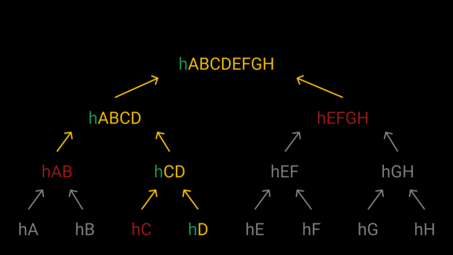

# Merkle tree

* 머클 트리
* 80년대 초 공개 키 암호방식 연구 결과로 잘 알려진 컴퓨터 과학자 랄프 머클(Ralph Merkle)이 제안
* 일련의 데이터 온전성을 효과적으로 검증하는 데 사용되는 구조
* 특별히 피어 투 피어(peer-to-peer) 네트워크 맥락에서 참가자가 정보를 공유하고 독립적으로 검증해야 하는 경우와 관련
* 핵심에는 해시 함수가 있다.
  
## 동작 원리

* 커다란 파일을 다운로드하려고 한다고 가정
  * 오픈 소스 소프트웨어를 통해, 다운로드하고자 하는 파일의 해시가 개발자에 의해 공개된 것과 일치하는지 확인해야 한다.
  * 두 해시가 일치한다면, 컴퓨터에 존재하는 파일이 개발자들의 것과 정확히 일치한다고 말할 수 있다.
  * 만약 해시가 일치하지 않는다면, 문제가 발생한다.
    * 소프트웨어로 가장한 악성 파일을 다운로드 했거나, 혹은 파일이 제대로 다운로드 되지 않았을 수 있다. 
    * 제대로 동작하지 않는다.
* 머클 트리를 이용한 해결
  1. 머클 트리로 파일을 덩어리로 분리
  2. 파일은 조각별로 다운로드된다.
     1. 토렌트에 파일을 공유할 때도 사용되는 다운로드 방식
  3. 이렇게 파일을 다운로드 하면, 이 자료는 머클 루트(Merkle Root)라 하는 해시를 제공한다.
     1. 단일 해시는 파일을 구성하는 모든 데이터 덩어리를 나타낸다.
     2. 머클 루트를 사용하면, 훨씬 간단하게 데이터를 검증할 수 있다.
        1. 조각 낸 데이터 덩어리를 해싱한다.
        2. 자식 노드의 해시 값을 2개씩 묶어 다시 해싱한다.
        3. 이를 반복해 최종 해시 머클 루트(또는 루트 해시)를 얻을 수 있다.
  * 이 방식대로 생성한 머클 루트를 이용하면, 다운로드한 파일이 나타내는 머클 루트와 자료를 제공하는 사람이 함께 담아 보낸 머클 루트를 비교할 수 있다. 
    * 두 머클 루트의 해시값이 동일하다면, 모든 파일을 안전하게 전달받았다고 할 수 있다.
    * 두 해시값이 다른 값을 나타낸다면, 데이터가 위변조되었을 수 있다고 확신할 수 있다.
      * 해시함수의 특징에 의해, 데이터를 조금만 수정하더라도 전혀 다른 머클 루트를 가지게 된다.
* 파일을 전송받는 과정에서 데이터에 변경이 생겼을 때 머클 트리를 사용하면, 데이터에 변경이 일어난 파일 조각을 찾고, 그 파일만 새롭게 다운로드 받을 수 있다. 
  * 한 부분에 결점이 있다면 파일을 다운로드 한 뒤 생성한 머클 루트와, 전달받은 머클 루트의 해시값이 다르다.
    * 이 경우, 파일을 전달한 피어(peer)에게 머클 루트를 생성하는 두 개의 하위 해시(hABCD와 hEFGH)를 요청할 수 있다.
    * 전달받은 두 개의 해시값 중에서, 한 개의 하위 해시에서 문제가 있다는 것을 확인
    * 마지막으로 결점이 있는 파일을 해시한 파일 조각만 다시 다운로드하면, 파일 전송을 보다 효율적으로 할 수 있다.
* 머클 트리는 데이터를 여러 조각으로 나누며 생성되며, 머클 루트를 형성하기 위해 반복적으로 해시화됩니다. 이후 데이터 조각이 잘못된 경우, 이를 효과적으로 검증할 수 있다.

## 머클 트리와 비트코인

* 머클 트리는 데이터의 무결성을 증명하는 데 사용되기 때문에, 비트코인을 비롯한 많은 암호화폐에 필수적인 요소이다.
  * 일반적인 블록체인의 블록 헤더에는 머클 루트 값이 필수적으로 들어간다.
* 머클 트리의 잎(Leaf; 트리의 종단)을 얻기 위해, 블록에 포함된 모든 트랜잭션의 트랜잭션 해시(TXID)를 사용한다.
* 마이닝
  * 채굴
  * mining
  * 블록체인 = 블록헤더 + 트랜잭션 목록
    * 블록헤더
      * 블록에 대한 메타데이터
      * 데이터의 형식이 고정되어 있기 때문에 크기 역시 고정적이다.
    * 블록에 들어가는 트랜잭션의 갯수는 블록마다 다를 수 있기 때문에 트랜잭션 목록의 크기는 가변적이다.
      * 일반적으로 블록헤더보다 크다.
  * 유효한 블록을 마이닝하기 위해 특정 조건에 부합하는 결괏값을 생성해야 한다.
    * 결괏값을 생성하는 방법은 데이터를 반복적으로 해시화하는 것
    * 마이너들은 이를 찾기 위해 수 조 번의 시도를 하며, 각각의 시도마다 블록 헤더의 임의의 숫자를 변경한다.
      * 논스를 변경한다고 하여 블록의 다른 부분이 바뀌는 것은 아니다.
      * 수천 개의 트랜잭션이 존재할 수 있으며, 매번 이를 해시화해야 한다.
  * 머클 루트를 사용한 간소화
    * 간소화는 해시 함수의 특징으로 인해 머클 루트를 쉽게 변경할 수 없기 때문에 가능하다.
    1. 마이닝을 시작할 때, 머클 트리에 포함하고 구성하려는 모든 트랜잭션을 정렬합니다.
    2. 루트 해시(32바이트) 결과를 블록 헤더에 집어넣습니다.
    3. 이후, 블록을 마이닝할 때는 전체 블록 대신 블록 헤더만 해시화하면 됩니다.
* 트랜잭션 검증
  * 단순화된 결제 검증
    * Simplified Payment Verification
    * SPV
    * 한정된 자원을 가진 기기로 노드를 운영할 경우, 모든 블록의 트랜잭션을 다운로드하고 해시화하기 어려울 수 있다.
      * 단순히 풀 노드로부터 트랜잭션이 특정 블록 안에 있음을 입증하는 증거인 머클 증명을 요청할 수 있다.
    * 오늘날의 블록에는 수천 개의 트랜잭션이 포함되기 때문에, 머클 증명을 사용하면 상당한 시간과 컴퓨터 자원이 절약
    * TXID가 ‘hD’인 트랜잭션이 이 블록 안에 포함되어 있는지를 머클트리를 사용해 검증하는 예

    

    1. hD와 같은 청크로 묶인 hC를 가져온다.
    2. hC와 검증하려는 hD를 사용해 hCD를 구한다.
    3. hABCD를 계산하기 위해 hAB를 가져온다.
    4. hAB와 hCD를 사용해 hABCD를 구한다.
    5. 머클루트인 hABCDEFGH를 계산하기 위해 hEFGH를 가져온다.
    6. hABCD와 hEFGH를 사용해 hABCDEFGH를 구한다.
    7. 만약 우리가 구한 hABCDEFGH의 값이 실제 블록헤더에 저장된 머클루트 값과 같다면, 해당 트랜잭션이 블록에 포함되어 있다는 것을 의미한다.