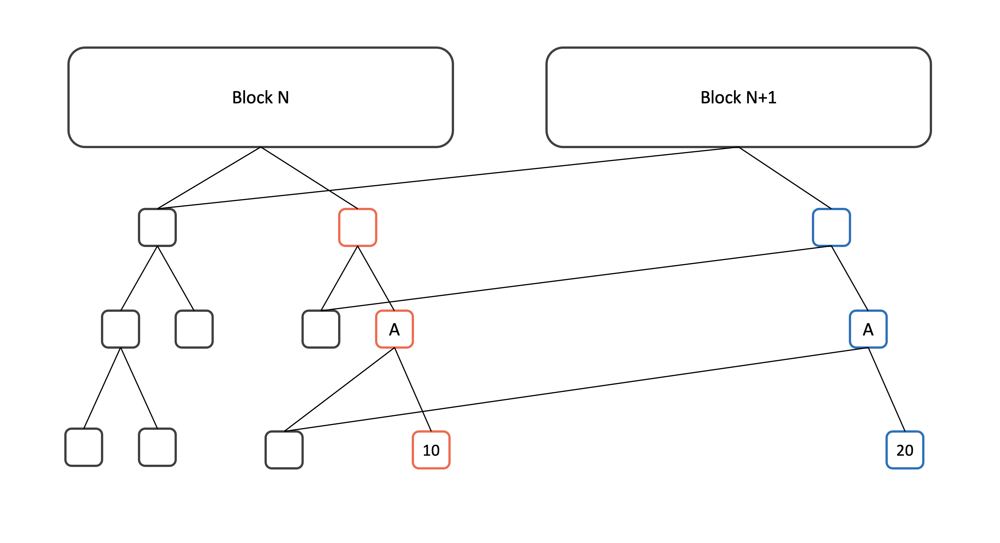

# Pruning

* 경량화 기법의 하나
* 학습 이후 각 심층 신경망 층의 상대적으로 불필요한 매개변수를 제거
  * 딥러닝 성능의 저하를 최소화
    * 성공적인 정확도를 가져오는 방법으로 사용된다.
* 블록체인에서 오래된 블록체인 데이터를 자동으로 삭제하기 위해 사용된다.

## 비트코인에서의 프루닝

* 0.11.0버전에서 추가
* Block File Pruning으로 설명되어 있는 가지치기 시스템(불필요한 매개변수를 제거하는 시스템)
  * 비트코인의 용량을 최적화 할 수 있다.
* 블록체인과 관련된 네 가지 유형의 데이터
  * 네트워크를 통해 수신된 Raw 블록
  * 실행 취소 데이터
  * 블록인덱스
  * UTXO
* 프루닝 실행 시
  * 비트코인 코어가 Raw 블록 삭제, 데이터 검증 및 데이터베이스를 구축하는데 사용되면 데이터를 실행 및 취소 할 수 있다.
    * Raw 데이터는 블록을 다른 노드로 릴레이하거나, 재구성을 처리하거나, 이전 트랜잭션을 조회하거나(-TxIndex가 활성화된 경우 또는 RPC/REST 인터페이스를 통해) 지갑을 다시 스캔하는데만 사용된다.
  * 블록 인덱스는 블록체인의 모든 블록에 대한 메타데이터를 계속 보유한다.
  * 사용자는 블록 및 실행 취소 파일에 할당할 공간을 지정한다.
    * 허용되는 최소 크기는 550MB
  * 블록 인덱스 및 UTXO 데이터베이스에 필요한 모든 것에 추가된다.
  * 비트코인 코어가 디스크에 최소 288개의 블록을 유지할 수 있도록 최소값이 선택된다.
    * 블록당 10분에 2일 분량의 블록
    * 드문 경우지만 디스크에 필요한 마지막 288개 블록을 유지하기 위해 사용된 공간 양이 정리 대상을 초과할 수 있다.
  * 디스크 공간이 할당될 때마다 블록 파일을 삭제
    * 정상 상태와 동일한 방식으로 초기 동기화 중에 작동
    * 사용자가 550MB를 지정하면 해당 수준에 도달하면 프로그램이 블록체인을 계속 다운로드하면서 가장 오래된 블록을 삭제하고 파일을 실행 취소하기 시작한다.
  * 현재 블록 프루닝은 블록 릴레이를 비활성화한다.
    * 미래에 블록 프루닝이 있는 노드는 최소한 활성 체인을 확장하는 블록을 의미하는 새 블록을 릴레이한다.
  * 블록 프루닝은 지갑 재검색 및 키나 주소 가져오기(재검색이 필요한)에 블록 데이터를 사용한다.
    * 현재 지갑 실행과 호환되지 않는다.
  * 블록을 프루닝한 후 이전 상태로 돌아가려면 전체 블록체인을 다시 다운로드해야 한다.

## 이더리움에서의 프루닝

* State Trie Pruning
* 현재 상태를 Prefix Tree의 일종인 Modified Merkle Particia Trie(MPT)로 저장한다.
* MPT는 State Root의 Hash를 계산하기 위해 State Trie 전체를 볼 필요가 없다.
  * 수정된 Branch의 Hash만 다시 계산하면 된다.
  * 빠르게 Root Hash를 찾을 수 있다.
* MPT를 이용하면 새로 추가되는 노드의 수도 최소화할 수 있다.
  * 위의 그림에서 Block N과 Block N + 1의 차이는 A의 오른쪽 자식의 값이 10에서 20으로 변경된 것 뿐이다.
  * 이 경우 10에서 20으로 변경된 노드의 부모 외의 다른 노드는 전부 기존의 노드를 재활용할 수 있다.
  * 푸른색으로 그려진 3개의 노드만 새로 추가하면 된다.
* 접근할 필요가 없는 노드들의 경우
  * 위의 예제에서 붉은색으로 표시된 3개의 노드는 Block N + 1에서는 필요 없는 노드이다.
  * 이더리움은 블록의 Finality를 보장하지 않는다.
    * 언제든지 Block N + 1이 Block N으로 Retract 될 수 있다.
    * Web3 API를 통해서 과거의 State에 접근하는 것도 가능하기 때문에 현재 상태에서 안 쓰이는 노드를 바로 지울 수는 없다.
  * 현재 이더리움에서 최신 State의 크기는 약 25GB 정도지만, 과거 State를 전부 저장하면 300GB를 넘어간다.
    * 크기는 점점 커질 것이기 때문에 이를 전부 저장하는 것은 현실적이지 못하다.
    * 이더리움은 접근할 수 있는 과거 State를 127개로 제한하여 그보다 오래된 State에만 포함된 노드는 지워도 되도록 한다.
    * DB에 저장돼있는 노드 중 최근 127개의 노드에서 접근할 수 없는 노드를 찾아 지우는 것은 쉬운 문제가 아니다.
* 문제 
  * Automatic Memory Management 문제와 비슷하다.
  * 비탈릭 부테린이 쓴 State Tree Pruning은 Reference Counting을 언급하고 있다.
  * 이더리움의 State Trie Pruning은 일반적인 Memory Management와 다른 점
    * Automatic Memory Management는 Volatile(휘발성이 있는)한 자원을 다룬다.
      * 프로그램이 비정상 종료되는 상황을 고려하지 않아도 된다.
      * 프로그램이 종료되면 관리해야 할 자원이 남아 있지 않기 때문이다.
    * State Trie의 노드는 DB에 저장되는 Persistence 메모리이다. 
      * 프로그램의 비정상 종료로 인해 State Trie가 비정상적인 상태가 되면 복구할 방법이 없다. 
      * 비탈릭 부테린이 제시한 State Tree Pruning이 메인 넷에 들어가지 못한 이유
  * Trace를 이용하는 방법
    * Tracing Garbage Collection도 Automatic Memory Management에서 흔히 사용되는 기법
    * Trace에 필요한 추가적인 메모리나, Stop-the-world에 의해 생기는 성능 문제 등이 먼저 해결되어야 한다.
  * 현재 Go-Ethereum에서는 매우 한정적으로 State Trie Pruning을 한다.
    * State Trie에 대해 캐시(Cache)를 사용한다.
      * 이 캐시에만 저장된 노드에 대해서는 Pruning을 하고 DB에 저장된 노드는 Pruning을 하지 않는 방식
      * 캐싱된 노드는 서버가 정상적으로 종료되거나, 생성된 지 128 Block이 지났거나, 캐시 크기를 넘겼거나, 마지막으로 캐시된 노드가 DB에 저장된 지 5분이 지나면 DB에 저장
        * 위의 조건을 만족하기 전에 Cache에서 삭제된 노드는 DB에 저장하지 않는다.
        * 생성된 지 5분이 지나지 않아서 삭제되는 노드는 그리 많지 않다.
          * 삭제됐어야 할 노드는 여전히 DB에 남아 있다.
  * 이더리움에서는 State Pruning을 구현하는 것을 계속 시도하고 있다.
    * State Trie Pruning이 실제로 구현되기 전에는 Fast Sync를 사용하여 다음과 같은 방법을 사용하기를 권장한다.
    * 새 노드에서는 Fast Sync로 동기화된 상태까지의 Garbage Node 없이 유효한 노드만 관리하기 위해 이전에 실행해야 하는 과정
      1. 새 클라이언트를 띄운다.
      2. 기존 클라이언트에서 새 클라이언트로 Fast Sync를 받는다.
      3. 기존 클라이언트를 지운다.
      * 주먹구구식 방식으로 보이지만, 위험 부담이 있는 Garbage Collection을 구현하는 것보다 안전하고 현실적인 해결책이다.
      * 이더리움에 Garbage Collection이 구현되기 전까지는 계속 위와 같은 방식을 이용해야한다. 