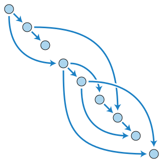

# 보안성을 위한 시도

## DLT

* Distributed Ledger Technology
* 기본적으로 데이터가 여러 곳에 나눠져 저장
  * 해커가 공격할 노드를 찾는 것이 쉽지 않다.

## DAG

* Directed Acyclic Graph
* 방향성 비사이클 그래프
* 과도한 수수료와 확장성 문제를 이를 해결하기 위한 기술
* 퍼블릭 블록체인의 확장성 문제
  * 채굴로 생성되는 블록안에는 새로운 거래이력이 추가된다.
  * 거래이력을 처리 할수있는 트랜잭션의 개수는 한정적이며 느린 편이다.
  * 트랜잭션 처리를 우선하기 위해선 채굴자에게 더 많은 수수료를 지불하는 것이다.
* 거래 시계열(일정 시간 간격으로 배치된 데이터들의 수열)에 특정한 방향이 있는 그래프 자료구조
  * 루프를 생성하지 않는다.
* 블록을 생성할 필요가 없다.
  * 블록 용량에 대해서 관여하지 않고, 한 줄로 나란히 되어 있지 않아도 된다.
  * 작업의 우선순위를 표할 때 DAG 구조를 가지게 된다.
* 블록체인과 비교
  * 블록체인
    * 사슬
    * 거래 길이로 신뢰성을 유지
    * 블록을 생성하여 트랜잭션을 검증
  * DAG
    * 그물처럼 거래를 맺는 기술
    * 거래 무게로 신뢰성을 유지
    * 각각의 트랜잭션들이 상호 유기적으로 검증
    * 채굴이 필요하지 않다.
    * 거래 이력을 각자 스스로가 관리한다.

## DHT

* 분산해시테이블
* Distributed Hash Tables
* 해시테이블(Hash Table)을 분산하여 관리하는 기술
  * 해시테이블을 네트워크 환경에 위치한 노드들에 분산하여 적용한다.
  * Hash Table
    * 해시테이블
    * 실제 값에 해시함수를 적용하여 형성한 키 또는 식별자의 조합에 대해 배열을 사용하여 빠른 검색을 하기 위한 자료 구조
* 특징
  * 시스템 전체를 중앙에서 관리하는 조직이 없다.
    * 스템을 이루고 있는 노드 수에 영향을 받지 않고 확장 가능하다.
    * 시스템 내부에 노드가 추가되거나 없어지거나 오동작을 하더라도 시스템 전체의 기능에 영향을 끼치지 않는다.
    * 중앙 시스템이 아닌 각 노드들이 이름을 값으로 맵핑하는 기능을 하는 방식
  * P2P 네트워크에 특히 많이 사용된다.
    * P2P 네트워크를 중앙에서 컨트롤 할 경우 
      * 네트워크의 이용효율이 좋아진다는 이점
      * 컨트롤이 중앙화 되어 있어 중앙 관리 시스템이 취약점이 될 수 있다.
    * 피어에 의지하는 방식
      * 중앙 집중 조직이 없기 때문에 뚜렷한 취약점은 없다.
        * 네트워크가 비효율적으로 사용된다.
  * 부하가 집중되지 않고 분산된다.
    * 순수 P2P라도 네트워크의 부하를 억제하여 네트워크상의 콘텐츠를 빠르고 정확히 검색할 수 있다.
    * 극단적으로 큰 규모의 노드들도 관리할 수 있다.
      * 기존의 순수 P2P에서 채택했던 방식에서는 수십만 노드 정도가 한계였다.
    * 수십억 개의 노드를 검색범위로 할 수 있다.
      * 완전한 일치검색만 가능하여 와일드카드 등을 활용한 복잡한 검색은 할 수 없다.
        * 실질적으로 구현하는 데 어려움이 있다.
  * Structured Key Based Routing 방식을 통해 P2P 시스템의 한계를 극복한다.

## IPFS

* InterPlanetary File System
* 동일한 파일 시스템으로 모든 컴퓨터 장치를 연결하려고 만든 분산 파일 시스템
  * 동일한 파일 시스템으로 모든 컴퓨터 장치를 연결하려고 만든 분산 파일 시스템
  * P2P 파일 공유 시스템으로 정보가 전세계적으로 배포되는 방식을 근본적으로 바꾸는 것을 목표
* 커뮤니티케이션 프로토콜과 분산화 시스템에 걸쳐 구성
  * 기존에 없는 파일 시스템을 구현
* HTTP
  * 비효율적이며 비용이 많이 든다.
* IPFS
  * 파일 조각을 동시에 여러 컴퓨터 노드로부터 가져오는 구조
  * 기존 대역폭 비용을 60% 이상 절감할 수 있다.
  * 다른 노드에 데이터를 저장하는 것도 가능하다.
  * 개방적이고 중앙집중화되어 있지 않기 때문에 웹의 중앙화를 막을 수 있는 기술