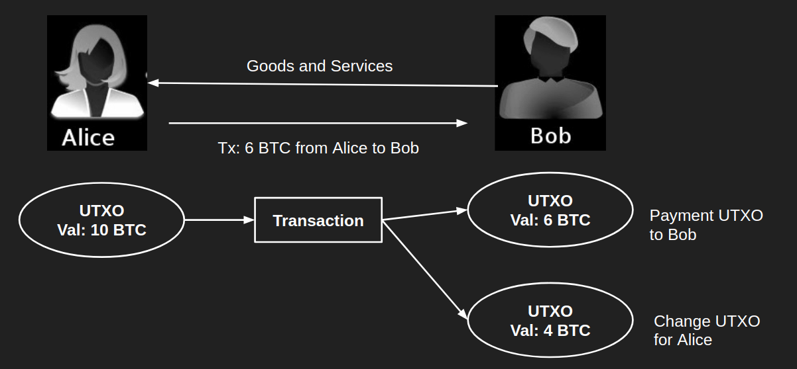

# Wallet

* 지갑
* 블록체인에서 실행되고 개인과 공개 키를 저장하고 해당 키와 관련된 모든 트랜잭션을 블록 체인에 모니터링하고 유지하는 소프트웨어
* 비트코인, 이더리움 등 암호화폐를 보관할 수 있는 계정
* 채굴과 노드에서 노드가 지갑이다.
* 종류
  * 데스크탑 지갑
  * 모바일 지갑
  * 하드웨어 지갑
  * 웹 지갑
* 구조
  * 공개 키 public key
    * 다른 사람들이 암호화폐를 송금할 수 있도록 공개해도 된다.
  * 암호 private key
    * 지갑 소유자 본인만 알고 있어야 한다.

## 지갑의 유형

* 가상화폐를 사고 파는 거래 서비스나 상품 대금으로 지급하는 결제 서비스의 구현에 있어서 구현 방식에서 보안 취약점이 존재할 수 있다.
  * 가상화폐 거래를 손쉽게 해주는 가상화폐 거래소에 대한 보안 사고가 최근에 자주 발생하고 있다.
    * 가상화폐를 거래하는 사용자들의 피해자가 증가하고 있다.
* Hot wallet
  * 핫 월렛
  * 인터넷 엑세스가 개인 정보 및 보안에 미치는 위험 때문에 덜 안전하다.
  * 사용자 친화적이다.
  * 작은 일상 거래를 위한 월렛
* cold wallet
  * 콜드 월렛
  * 암호화폐의 콜드 스토리지에 사용되는 암호화폐 지갑 유형
  * 보안 강화를 위해 오프라인에 저장된다.
  * 금고에 가깝다.
  * 장기 보유를 위한 월렛
* 다중 서명 월렛
  * multisig wallet
  * 다중 서명 암호화폐 지갑
  * 거래를 완료하기 위해 여러 당사자의 입력이 필요한 암호화폐 지갑 유형
  * 모든 당사자가 거래를 완료하기 위해 PIN을 입력하거나 주문해야 하는 공유 은행 계좌와 유사하다.
  * 가족과 기업 모두가 사용하기에 이상적이다.
* 다중 통화 월렛
  * multi-currency wallet
  * 여러 유형의 암호화폐를 모든 암호화폐에 대한 한 장소에 저장할 수 있다.
    * exodus
      * bitcoin, ether, eos, dash 등 통화 저장 가능
  * 일부 암호화폐 지갑에서는 암호화폐 A를 B로 변환할 수 있다. 
    * shapeshift 와 통합을 통해 수행된다.
    * 변환할 수 없는 경우 온라인에서 이를 수행하기 위해 추가 단계를 수행해야 한다.
    * 시작하기 전에 핫 월렛에 대한 shapeshift 통합을 찾는 것이 중요한 이유
* 웹 월렛
  * 웹 브라우저를 통해 액세스하는 암호화폐 지갑
  * 모바일 또는 데스크탑 월렛처럼 개별 플랫폼을 구분할 때 웹 브라우저에서 사용하는 지갑을 특정해 부른다.
  * 장점
    * 트랜잭션을 완료하는 가장 빠른 방법
      * 앱과 서버 위치 사이에 지연이 없다.
    * 소량의 암호화폐 보유에 이상적이다.
    * 일부는 여러 암호화폐를 관리하거나 둘 사이에서 금액을 전송하거나 거래소에 직접 통합할 수 있다.
  * 단점
    * 사용자는 피싱 사기, 맬웨어, 내부자 해킹, DDoS 공격 및 구식 보안 조치에 취약하다.
    * 웹 월렛의 암호화폐 정보는 제 3자에 저장된다.
  * 코인베이스
    * 대표적인 웹 월렛
    * 정해진 종류의 암호화폐만 취급한다.
    * 현재 약 70여종의 암호화폐를 취급한다.
    * 지갑 이외의 다양한 서비스를 제공하는 플랫폼으로 발전하였다.
      * 개인, 기업, 개발자를 위한 서비스가 제공되고 있다.
    * 웹 지갑이기 때문에 모바일 앱의 형태로도 사용할 수 있다.
    * 계정의 스타일에 따라 추적이 불가능한 고급형 지갑을 만들 수도 있다.
    * 악용될 우려도 존재한다.
    * 보안에 위험이 있을 수 있다.
    * 코인베이스 Pro
      * 암호화폐를 구매할 때 사용하는 거래소
      * 지금은 현금 또는 카드 결제를 통해 암호화폐를 구매할 수 있지만 초기에는 코인베이스 프로를 통해서만 암호화폐를 구매할 수 있었다.
      * 바이낸스, 업비트 등과 같은 암호화폐 거래소
      * 거래소마다 핫 월렛과 콜드 월렛의 공개 범위 또는 사용처가 다르다.
* 모바일 월렛
  * 모바일 장치가 있는 곳이면 어디에서나 암호화폐에 엑세스 할 수 있도록 도와준다.
  * 추가 기능을 제공하지만 추가 보안 위험도 따른다.
  * 장점
    * 다른 암호화폐 지갑 유형보다 실용적이고 사용하기 쉽고 즉시 지불을 수락하거나 보낼 수 있다.
    * QR 코드 스캔과 같은 온라인 및 하드웨어 지갑 이상의 추가 기능
  * 단점
    * 휴대폰이 악의적으로 손상되거나 루팅된 경우 지갑 앱 암호화도 위험하다.
    * 휴대폰 자체가 멜웨어, 키로거 및 바이러스에 노출되어있다.
* 데스크탑 월렛
  * 온라인 지갑과 모바일 지갑보다 다소 안전한 것으로 간주된다.
    * 온라인 보안을 잘 적용한 경우에 따라 달라진다.
    * 완전히 오프라인으로 오래 된 랩탑을 사용하는 경우 새로 설치한 운영체제에서 효과적인 콜드 스토리지 방법이다.
  * 장점
    * 사용하기 쉬운 암호화 지갑 유형
    * 타사 서버에 저장되지 않은 개인 키
  * 단점
    * 인터넷에 연결된 경우 보안 및 개인 정보 보호 관련 주의 사항이 있다.
    * 물리적으로 고장난 경우 복구할 방법이 없다.
    * 수리를 맡길 경우 코인을 빼앗길 수 있다.
    * 멜웨어, 키로거 및 바이러스에 노출될 수 있다.
* 하드웨어 월렛
  * 웹, 데스크탑 월렛에 비해 사용자 친화적이지 않다.
  * 종이 월렛보다 작업하기 쉽다.
  * 핫 월렛보다 안전하다.
  * 배터리가 필요한 경우도 있고 필요하지 않은 경우도 있다.
  * 일부는 개인 키를 백업하기 위해 컴퓨터가 필요없다는 것을 의미하는 화면이 있는 경우도 있다.
  * 자주 이동할 필요가 없는 많은 양의 암호화폐를 저장하는 데 적합하며 더 많은 제어 기능을 제공한다.
  * 장점
    * 암호화폐를 장기간 보관하는 가장 안전한 방법
    * 대부분의 경우 모든 지갑보다 강력한 보안
  * 단점
    * 약간 번거롭다.
    * 별도의 사용법을 익혀야 한다.
* 종이 월렛
  * 하드웨어 월렛 이전의 콜드 월렛의 표준
  * 일반적인 종이 월렛, 보안에 특화된 종이 월렛이 있다.
  * 장점
    * 해커로부터 가장 안전한 암호화 지갑 중 하나
    * 대컴퓨터에 저장되지 않는다.
    * 타사 서버에 저장되지 않는 개인 키
  * 단점
    * 약간 번거롭다.
    * 별도의 사용법을 익혀야 한다.
    * 더 많은 기술적 이해가 필요하다.

## UTXO

* Unspent Transaction Outputs
* 미사용 트랜잭션 출력값
* 입력에 의해 생성된 후 다른 입력에 의해 해제되지 않은 트랜잭션 출력
* 이더리움의 어카운트와 달리 계정이나 잔고가 없고, 블록체인에 기록된 소비되지 않은 출력값을 통해 거래의 유효성을 검사하여 코인의 존재 여부를 확인한다. 
* 코인이 지갑이 아니라 UTXO에 저장된다.
* 한 번 사용하고 사라져 익명성과 보안성이 강하다.
* 장점
  * 이중 지불 방지
    * 트랜잭션을 발생시키면 해당 UTXO는 검증을 받은 후 TX Pool에 들어간다.
    * 이중 지불이 발생하면 채굴자들은 Pool에서 UTXO 검사 후 사용 기록이 있다면 해당 거래를 무효화 할 수 있다. 
    * 하이퍼레저 패브릭 Hyperledger Fabric에서도 UTXO를 사용한다.
  * 잔고의 증명
    * 추적하기 용이하다.
    * 거래에 대한 유효성을 검증하기 매우 쉽다.
    * 해당 사용자의 UTXO만 확인하면 되기 때문에 트랜잭션을 모두 검증할 필요가 없다.
* 단점
  * UTXO가 과하게 생성이 될 경우가 있다. 
  * 흩어져있는 UTXO를 모두 모아야 점검할 수 있다.
  * 소액 결제를 엄청 자주 하거나, 채굴로 이자를 받게 되면 과도한 UTXO로 인해 불필요한 수수료를 내야 할 수 있다.
* 잠겨있는 비트코인
* 코인을 담고 있는 상자
  * 다양한 양의 코인을 담을 수 있다.

* 가격이 6BTC이고, 구매자가 10BTC를 가지고 있을 때 10BTC는 하나의 UTXO에 들어있다.
* 트랜잭션은 입력을 통해 우선 10BTC가 든 출력을 해제한 후에 두 가지 새로운 출력을 만든다.
  * 판매자에게 지불해야하는 6BTC가 든 출력
  * 구매자에게 거슬러줄 4BTC가 든 출력
  * 아직 다른 입력에 의해 해제되지 않았기 때문에 UTXO(미사용 트랜잭션의 출력값)이 된다.
* 확장성이 좋다.
* 로직이 매우 단순하기 때문에 병렬적으로 트랜잭션을 검증할 수 있다.